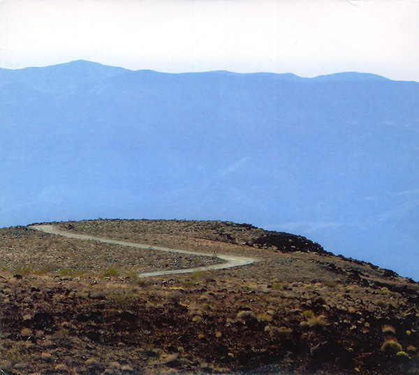

\[caption id="attachment\_4622" align="aligncenter" width="600"\] _A Mendicant Hymnal_\[/caption\]

A mendicant is a travelling monk — one who begs for subsistence, accepting what people and to world have to offer, in humility. The music on this double album could be a distillation of the world experienced in such a way: a flowing by of landscapes and visions, an endless sequence of steps carrying one to some unknown destination. This is the final act of begging and acceptance: to see where the journey leads you, always deferring to decisions made outside of the self; offering up the self.

**Raising Holy Sparks** is the project that rose from the ashes of **Agitated Radio Pilot** and saw **David Colohan** shifting from lo-fi and singer/­songwriter releases to something more instrumental, raw, and abstract. The division is far from clear-cut: Agitated Radio Pilot had its share of lush ambient improvisations, and the occasional harsh guitar solo, while Raising Holy Sparks has had plenty of songs interspersed on its earlier releases. All the same, there is a tangible contrast between the two projects.

_A Mendicant Hymnal_ is part of a larger series of albums by the same title, all of them inspired by North American landscapes, but I feel that this album is the central one. Its size is imposing: over two hours of music, with plenty of tracks crossing the 10 or even 15-minute mark. Extended meditations on soil and sky, tapping into their history and prehistory somewhere between the Earth as experienced by humans and as it experienced itself over vast aeons of time. Perhaps it is the tempo: often too slow for any regular sense of musical comfort, too minimal to hold rational attention, furtively lived. The music, like the land, offers us something in a particular way, and we might have to shift gears to understand what is being said. Understand might not even be the right word: Earth does not speak to us in language, and neither does music.

Some tracks are closer to us: the perspective moves to meet that of the traveller. The opening track, “A Stretch of Haunted Road”, is short, overwhelmingly melancholic. It even has a sense of despair that would become overpowering if it lasted for too long. The solution is to let go of that perspective, and take refuge in a partly imagined wider perspective, to let go. “Rio de las Animas Perdidas” is the first taste of what that shift brings. The River of Lost Souls flows serenely, at first, perhaps because it is there to embrace those souls and give them solace. At the same time, the track's second half is darker: a throbbing bass pulse and more ambiguous melody make problematic the idea of a complete, blissful detachment from the human.

This impossibility seems to haunt the album: the mendicant can live on a different scale, change their relation to the world, but they remain human. One can stretch away from the human experience by communing with nature — it is possible to hear what it has to say — but we can't let go of the human tragedy. The darker moments of the album bear witness to this. “Within the Painted Desert” ends in anger, just as the first track ended in despair. So do their mirror images on the album's second disc: “The Credo of Dissolving” and “There Is Evil in His Machinery”. They stand in stark contrast to the peace that may be found elsewhere. Temporarily perhaps, but still. There are rivers to bathe in, to cleanse us of what ails us. At night, we can watch “Meteors over the Mesa”, and bear witness to the celestial glory that dwarfs us, our struggles, and our time.

Since it came out in late 2013, I've wanted to compare this album to one released six years before: Agitated Radio Pilot's crowning achieve­ment, [_World Winding Down_](http://www.eveningoflight.nl/2008/02/01/review-agitated-radio-pilot-world-winding-down-2007/ "Review: Agitated Radio Pilot – World Winding Down (2007)"). It was similarly ambitious in scope: two symmetrical CDs that showcased some of Colohan's best songs, with guest appearances by a ton of his friends and fellow artists. I wanted _A Mendicant Hymnal_ to be that, but for Raising Holy Sparks. But sometimes symmetry and perfect analogies aren't everything. This album is not the same kind of intricately wrought creation where every track is in its right place, where every piece of ambient enforces the melancholic guitar song that follows. Instead, _A Mendicant Hymnal_ is what happens when you don't think overmuch about imposing order, and listen to what (the memories) of the lands you travel(ed) have to tell you. It is raw, full of the organic structure that is more of nature than of art. And I mean that in the best way.

Behind the metaphor of mendicant journeys and Earth language, there is a very particular set of instruments. The album's ambient backbone consists of an array of synthesizers, keyboards, and piano sounds — some straight-up, some sampled. There is harmonium, harp, guitar, and the occasional element of percussion and field recordings. A small cast of guest musicians (**Richard Moult**, **Casey Denman**, **Michael Tanner**, and **Declan Kelly**) take up some of these roles on some of the tracks, and the four final tracks are remixes of various materials found elsewhere on the album. All of it sounds organic, slightly hazy: a perfect aural metaphor for the sounds of the land.

Looking at the other tracks, I'm again tempted to force them into a system, but the album itself teaches us that some moments, some encounters, just come along unexpectedly. Among the plains and stretches and rivers, there is a place that this album calls “We Will Rest Forever in the Fields of the Lord”. Here, soft flows of guitar glide over the abode of crows. Out of nowhere, something glorious rises and makes a perfect, deeply hopeful note in this bleak album. I associate this track with the death of loved ones, but also with the spiritual hope — and it is a strong one — that they have found a peace that the wanderer on Earth is unable to wholly reach.

But here, these places don't last. Before we know it, time has caught up with us and we must away. A piano-driven ride — do mendicants ride trains? — takes us through “Shadow City, Missouri” and we end up… I'm not sure where. “Monachus Mortuae Religionis” exists in a place where wolves howl to introduce the most minimal of synth chord progressions. It's like something from  “Wicked Game” or “Streets of Philadelphia”, stripped down to bare bones, and it is grand. Like ethereal waves endlessly crashing on a shore.

It is these loose moments, unforeseen, irrational, that are the power of this album's strange journey. It exists somewhere between music, rooted in ambient and the evolved experimental folk of Northern Europe, and the North American landscape, the landscapes of the mind — and perhaps the universal experience of a human, given over to the universe. This offering of the self is at once the theme of this album, and a way of understanding it. Always temporary, but revealing something eternal. “Perenne Lumen in Templo Aeterni”.

<iframe style="border: 0; width: 100%; height: 120px;" src="https://bandcamp.com/EmbeddedPlayer/album=4229136616/size=large/bgcol=333333/linkcol=2ebd35/tracklist=false/artwork=small/transparent=true/" width="300" height="150" seamless=""><a href="http://davidcolohan.bandcamp.com/album/a-mendicant-hymnal">A Mendicant Hymnal by Raising Holy Sparks</a></iframe>
