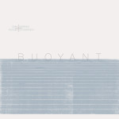

**Dirk Serries & Rutger Zuydervelt** - _Buoyant_ (2015, Consouling Sounds)

This is one of those collaborations that was bound to happen at one point: two of the Low Countries' foremost ambient artists hitting it off together on an album. Serries' wavy and sometimes crunchy approach is offset by Zuydervelt's tendency towards warping and choppy structure. However, most of the time their approaches merge seamlessly and I can't tell who is doing what. Clearly this is a good thing in this case, as they achieve a sound that is rather apart from their solo works.

"The Whispering Scale", as showcased in [May's second Cloudscape](http://www.eveningoflight.nl/2015/05/18/cloudscape-53-may-2015-2/), is a case in point. A warmth, gradually rising over more than ten minutes, growing a subtle heartbeat, and transforming into a sublime concrete loop at the end. The opening track sees the two artists gently aligning each other's sounds, though the result has an interesting tension: like burlap rubbing against velvet.

On the whole, _Buoyant_ is a pleasant, airy affair. It is not _too_ surprising if you're familiar with either artist's earlier work, perhaps, but it does certainly showcase their skill at creating well-flowing tracks with tons of interesting details.

**Richard Moult** - _Last Night I Dreamt of Hibrihteselle_ (2015, Wild Silence)

After quite a few years and albums of mostly instrumental music, Richard Moult flies back towards a format explored in 2005's _[The Secret Joy](http://www.eveningoflight.nl/2007/12/31/review-richard-moult-the-secret-joy-2005/)_: the song cycle. Those years have surely flown by… but I digress. The approach in that earlier album — piano and classical voice — was traditional, in a way, although Moult's piano melodies have always had something uncanny. Here, he abandons most connections to a classical approach, and weds his compositions and (again mostly) Mary Webb's poems to an ensemble of various singers, some untrained. He also opts for electronic keyboards over acoustic instruments, except for the occasional guest appearance: Áine O'Dwyer is in excellent form in her harp contribution to "The Bramble Patch".

_Last Night_ possesses a strange brilliance. The voices are diverse, more at home out in the fields than in an auditorium. The keyboards make no attempt to sound un-keyboard-like, thereby fully embracing their own sound. The compositions fly wild, but there is a sure voice in there. I have incredible difficulties putting into words what is going on on this album, but with each listen I am more sure that Moult has found a new way to interweave various musical traditions — from classical to folk to pop — that together sound not like they've emerged from a particular place, but are blown in over the Atlantic from beyond the mists of time. If this sounds inscrutable, well, so does the album.

**Andrew Weathers Ensemble** - _Fuck Everybody, You Can Do Anything_ (2015, Full Spectrum)

Americana with autotune. It sounds like a gimmick until you hear it. On _Fuck Everybody_, Weathers puts a contemporary twist on essentially romantic music. There's still plenty of American folklore and landscape in here, but infused with a here-and-now aesthetic. It's music that harkens back, but not necessarily to the past; more like a spectrum of current Americas.

The album is rather ambient in nature, free-flowing and weird at times, and not traditionally song-based, although elements of songs are woven into the music as a whole. While the vocals do draw attention, there are beautiful band arrangements in these songs. Andrew Weathers solo is mostly guitar/banjo, but here he really did bring his Ensemble, with various woodwinds, strings, brass, and electronic contributions from a guest roster 15 heads strong.

_Fuck Everybody_ came as a surprise, but a beautiful one. Great tunes for a long, hazy summer.
