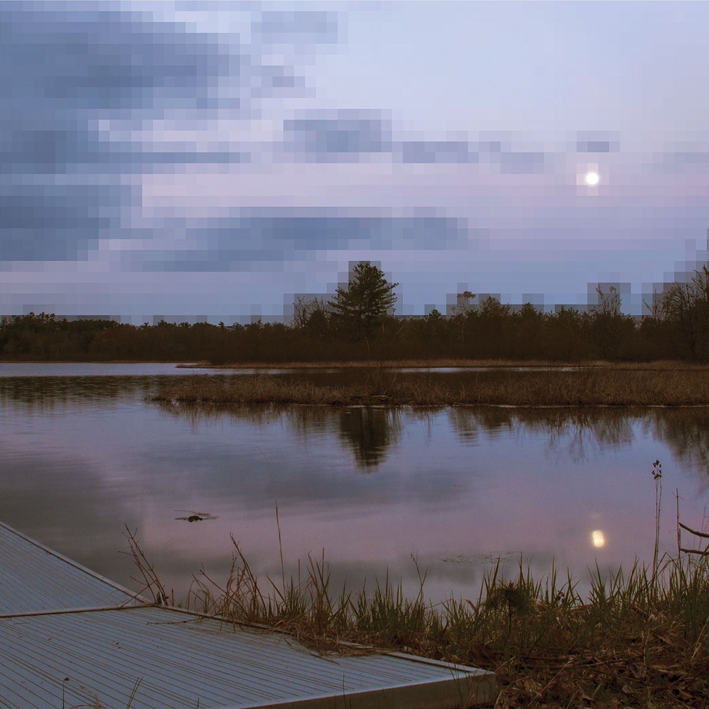
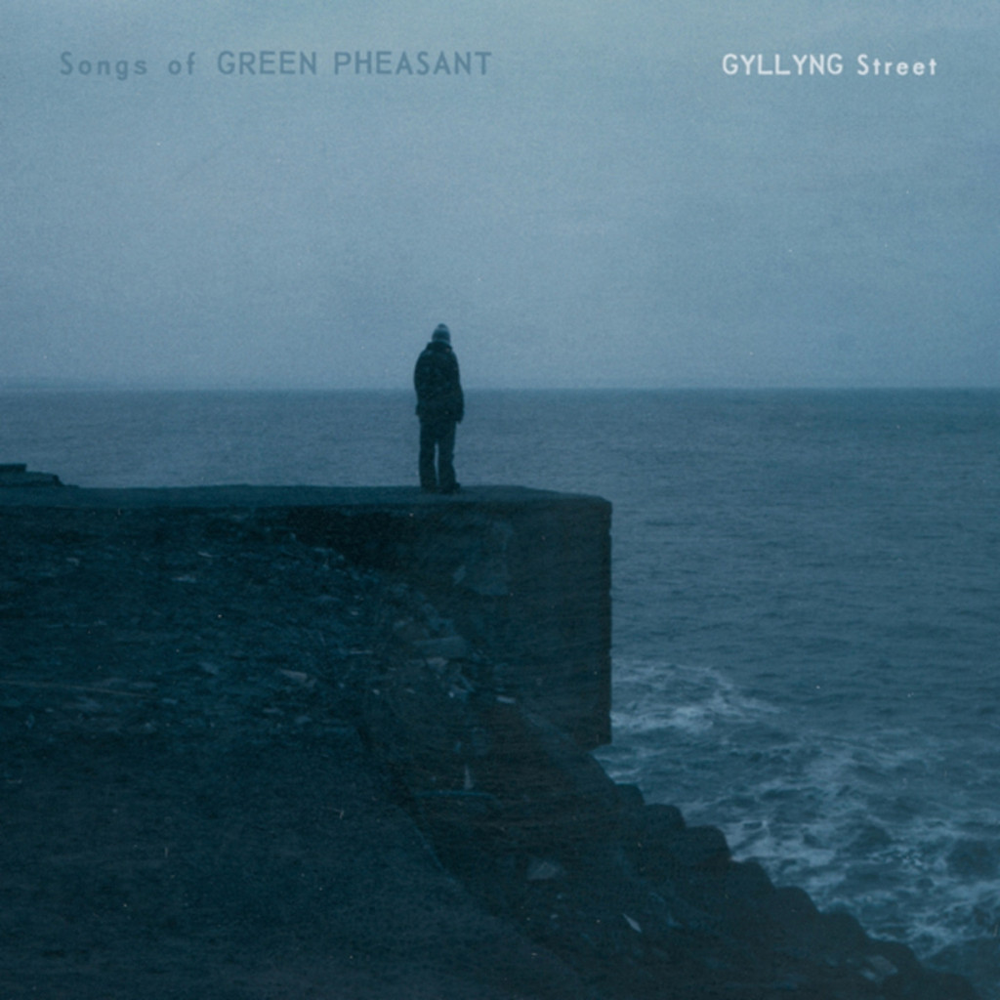

\[caption id="attachment\_4702" align="aligncenter" width="1200"\] Nin-o-Van\[/caption\]

Some promos trigger interesting chains of (re)discovery. Recently, the steadily impressive [Full Spectrum](https://fullspectrumrecords.bandcamp.com/) records sent me _Nin-o-Van_ by **Cedar AV**. This five-track album occupies something of a lo-fi ambient guitar territory that I can really go for from time to time. My search for inner calm has darted into disparate directions recently — mainly black metal and jazz, next to the usual folk and ambient fare — but music like this quite directly goes into calm and melancholic trajectories.

_Nin-O-Van_ is easy listening, with something of a fireside (or porch) vibe to it, suggesting — like the album cover — a view out over some kind of American outback. Probably Wisconsin, since that's where the trio is based. Besides what follows below, the album reminded me of **Clint Heidorn**’s _[Atwater](http://www.eveningoflight.nl/2013/02/06/review-clint-heidorn-atwater-2011/)_ album, which explored similar music–landscape interactions.

The album starts nicely poppy with handclaps, tambourines, and backgrounded vocals in the title track, alongside the melodic guitars the dominate much of the record. The trio soon reveals a predilection for sharp electronic and glitchy elements: the end of the first track ends in a gritty haze, alongside field recordings. This balance between the organic and electronic is maintained throughout the album. The instrumental nighttime sounds of "[Minnott](http://www.eveningoflight.nl/2015/11/15/cloudscape-57-november-2015/)" slowly dawn into "Pike", which puts a fragmented uplifting chord progression over a pleasantly tinkly ambient backdrop. It's a little bit like a chopped up "Boys of Summer", if that makes sense. "Pine River" is minimalist, with a sad vibe, reminiscent of **Agitated Radio Pilot**’s moody lo-fi works. "Sun House", finally hits that more accepting, laid-back side of _calm_, where everything turns out to be alright. A shimmering, comforting way to end an album.

Have a listen to the entire thing here:

<iframe style="border: 0; width: 600px; height: 307px;" src="https://bandcamp.com/EmbeddedPlayer/album=3638704871/size=large/bgcol=333333/linkcol=2ebd35/artwork=small/transparent=true/" width="300" height="150" seamless=""><a href="http://fullspectrumrecords.bandcamp.com/album/nin-o-van">Nin-o-Van by Cedar AV</a></iframe>

I enjoyed _Nin-o-Van_ quite a bit, but it also put me in mind of Duncan Sumpner's **Songs of Green Pheasant** and his album _[Soft Wounds](http://www.eveningoflight.nl/2012/02/18/review-songs-of-green-pheasant-soft-wounds-2012/)_, which I covered here when it came out a few years ago. That's an album that regularly finds its way back to me, an understated little gem of wistful songs and instrumentals. I vaguely recalled that Sumpner made a couple of other albums before it, and I decided that now was a good time to hunt one down.

\[caption id="attachment\_4703" align="aligncenter" width="1024"\] Gyllyng Street\[/caption\]

_Gyllyng Street_ (2007) arrived last week, and though I can't seem to find any lasting peace right now, I can get at least 40 minutes of it whenever I put this on, which is at least a couple of times on recent work days. The album relies a bit more on electric guitars than _Soft Wounds_, yet it still has that quiet melancholia: Sumpner's warm, languid voice, songs that rely on simple, strong melodies, occasionally picking up a bit of pace with bass and threadbare drums.

The whole album is incredibly strong, but the opener "Boats" stands out as a strong introduction to Sumpner's whole sound. The slow pace is initially deceiving, hiding an inner power that later comes out through a cutting lead guitar part.

https://www.youtube.com/watch?v=7hiAgQ2pnQg

Coming on the heels of the (relatively) energetic "King Friday" and strong piano and guitar-driven "West Coast Profiling" — which in turn are separated by the almost whispered "The Ballad Of Century Paul" — is another one of my faves, "Alex Drifting Alone", again showcasing how subtle Sumpner is at crafting a seamless flow in his albums. Here, like on _Soft Wounds_, we're treated to some beautiful trumpet accents too.

https://www.youtube.com/watch?v=6x29hiEgM4w

And at the end, thought, the album has one of my favourite surprises: an ambient track. I love it when folksy artists wander a bit, and while Agitated Radio Pilot’s "[The Barren Ground Assembly](https://agitatedradiopilot.bandcamp.com/track/the-barren-ground-assembly)" is still my favourite surprise ambient closer, Sumpner comes pretty damn near here with "A Sketch for Maenporth". Proper sampled rattlings and other stuff, cold delayed guitars, and the gradual swell of a pulsating beat. I wouldn't mind a whole lot more of this, but hidden away at the end of a song-based album isn't a bad place either.

So yeah, I'm still searching for a bit of calm, but at least music keeps pulling me in interesting directions, where the new can trigger the old and lead back to another something new. If you're in need of some calm as well, you could do worse than to seek out _Nin-o-Van_ on [tape or digital](https://fullspectrumrecords.bandcamp.com/album/nin-o-van). _Gyllyng Street_ may still be found as well, but mostly second hand. There's not many traces of it online.
