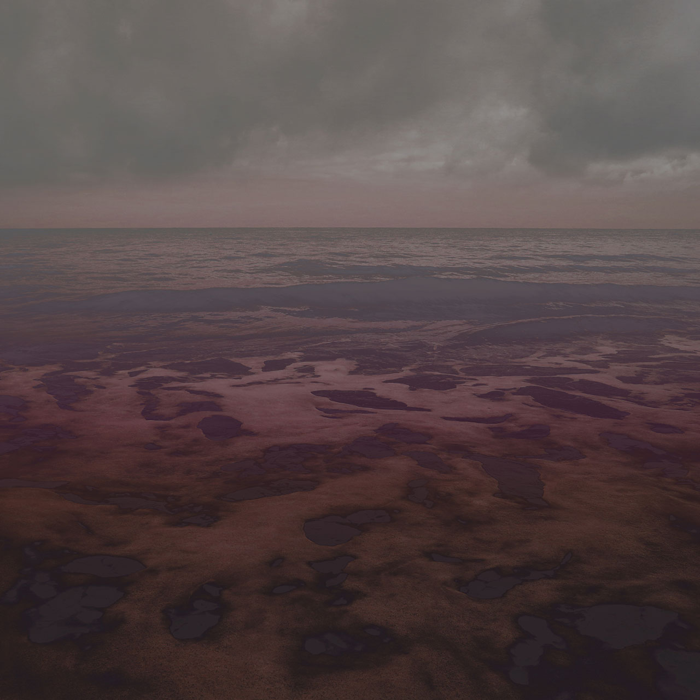

__

_[In the cities of your eyes](https://inthecitiesofyoureyes.bandcamp.com/album/in-the-cities-of-your-eyes)_ is a compilation for the benefit of refugees residing in camps in insular Greece, with all proceeds going to camps on Lesvos, Chios, Samos, and Leros.

It's a collection of 23 tracks from the experimental corners of the musical spectrum, and a heavy bent towards experimental folk (e.g. **Sandfingers**, **Howling Larsons**, **Martyn Bates**, **Stone Breath**) and (post)industrial sounds (e.g. **Cindytalk**, **Pylae**, **Amboo**). Despite these rough genre directions, the tracks are quite diverse, and it's not really possible to give an impression of the way the album flows. As fickle as the sea, I suppose.

A selection of my favourite tracks, then. Cindytalk's "Lost In The Hum Of The World" is a shimmering piece with an occasional dark drone. Rough edges but with bits of light. **Susan Matthews** and **Rainier Lericolais** have an intriguing lo-fi piece with piano, strings, and woodwinds, a bit like early In Gowan Ring, and older psychedelic ancestors. "Cave" by **Elektronik Meditation** is long and varied drone piece moving from synth to guitar. Stone Breath and **The Gray Field Recordings** are always good, in my book, and their tracks here are no exception. A deceptively simple but typically strong guitar and voice piece from the former, and some unsettling noises and voices from the latter.

It's not fair to expect a benefit compilation to have a strong overarching musical vision, and that's not what happened in this case either. Rather, what binds it all together is acquaintance, centering around the Greece-based musical couple of Rebecca Loftiss (The Gray Field Recordings) and Alan Trench (Temple Music), and a shared concern for the plight of the refugees who end up on that country's shores.

Personally I can't think of many worthier causes than to receive refugees with as warm a welcome as possible. Picking up this compilation is a good way to send an extra contribution in that direction, and you'll get some fine tracks in the bargain. Have a listen below, and be on the lookout for some of these tracks in upcoming Cloudscapes.

<iframe style="border: 0; width: 600px; height: 472px;" src="https://bandcamp.com/EmbeddedPlayer/album=2412740928/size=large/bgcol=333333/linkcol=4ec5ec/artwork=small/transparent=true/" width="300" height="150" seamless=""><a href="http://inthecitiesofyoureyes.bandcamp.com/album/in-the-cities-of-your-eyes">In the cities of your eyes by In The Cities Of Your Eyes</a></iframe>
