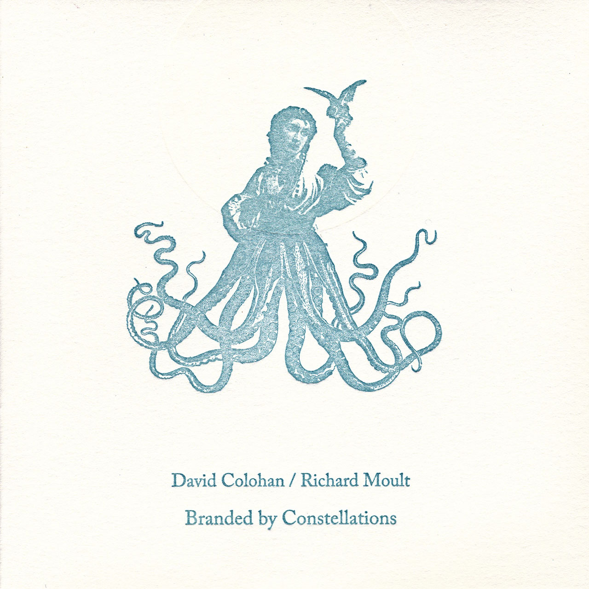
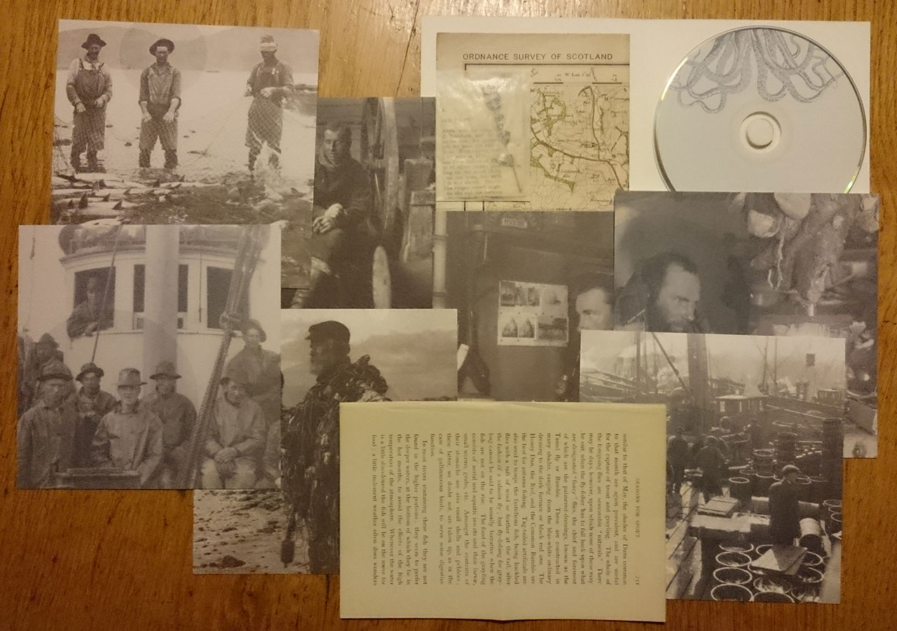

_Branded by Constellations_ is minimalist, an ode to lives spent away from home, that of sailors and fishermen. It's cold and desolate, sure, but as with many darker ambient works, that's the point. The idea is to go on a musical excursion, to witness harsh landscapes and weather, an interpretation of pieces of a life most of us don't live.

David Colohan and Richard Moult are no strangers, not to me, and not to each other. They've collaborated before, on **Agitated Radio Pilot** tracks, once as a duo on _Hexameron_, and often as part of **United Bible Studies**. Here, they offer something of a split album, although the two clearly settled on a shared vision, stopping just short of actually working on each other's contributions.

The excursionary approach is echoed strongly in the packaging, cared for by Fluid Audio. Lovely-smelling matte prints of old nautical scenes take up most of the envelope the album comes in, and we're drawn to the interaction with land and landscape by survey maps and angler's instructions.

Side Colohan — "As The Stars Change Places With The Falling Snow" — is a calm sea, floating accordion and autoharp notes, subtle analog synths, snatches of waves gently crashing and radio voices. It would fit in with some of the best ambient works from earlier Agitated Radio Pilot albums, but is not out of place among Colohan's more recent work as **Raising Holy Sparks** either.

Side Moult — "A Moorland Shrine / The God Of Disappearances" — is slightly darker, stemming from the side of his work that takes its classical base material (piano and strings) and distorts it into something primal. Here we really feel the sound/water wave analogy collapse back into itself, especially near the end where the piano tones stretch, collide, ebb, and flow.

It's also an ode to the Atlantic, not a place, but a _body_ that features heavily in the works of both artists. And while I know there are plenty of sunny days to be had on its shores, this album reminds us that the ocean is a fickle entity, where warmth and freshness may give way to brooding darkness and violent rage.

<iframe style="border: 0; width: 600px; height: 208px;" src="https://bandcamp.com/EmbeddedPlayer/album=3636354093/size=large/bgcol=333333/linkcol=ffffff/artwork=small/transparent=true/" width="300" height="150" seamless=""><a href="http://richardjohnmoult.bandcamp.com/album/branded-by-constellations">Branded By Constellations by David Colohan / Richard Moult</a></iframe>
