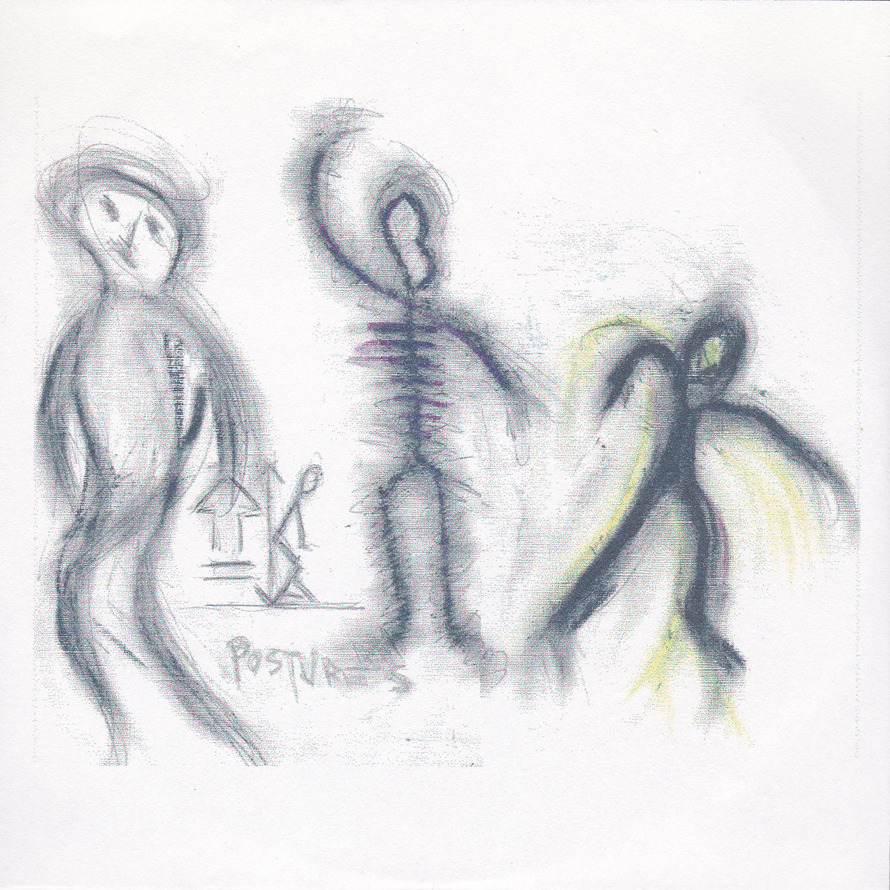

Recently, in a fit of wanting to clean up some aspects of my life — ergo, my office — I came across a CD-R that I had received somewhere at the tail end of 2009. While cleaning, I put all the promos I couldn't directly find MP3 recordings of on a big pile and added them to the digital collection.

I'm pretty sure that for some reason I had never listened to _Environs 1_ by **Home Planet** before. I really do listen to practically all promos I get, but somehow this one — and its sister album, a self-titled work by **Transmission**, both made by Steve Lofkin — got lost in the noise. It might have been because I had just graduated from university and started a new job at a bookstore at the time — a few months later I had started doing my Cloudscapes as an alternative form of coverage that was less time-consuming than writing reviews. In the end, it's a poor excuse. These albums just got away from me.

Finally, then, the MP3s of this album found their way into my big digital "music to check out" folder, and soon enough it came around during a shuffle. And then I found out that _Environs 1_ is really nice. (_Transmission_ is probably also really nice, but it's this one I've been playing a lot and which therefore gets the focus here.)

It's a guitar-based drone album, though much more of the spacy floaty kind than the heavy one. Three long pieces paint — despite the name — pictures of alien worlds and landscapes, with the first two tracks ("Landing" and "Orbiter") bringing mysterious and foreboding tones, though nothing outright menacing. There are layered loops of guitar here, with different textures and intensities, but not so many that the music would lose its lightness.

The final track, "Touch Free In Rain", is slightly different: a place of thunder and rain. Rather than melodies and tones, obscure metallic scrapings and clangs accompany the extraterrestrial weather. Only about halfway through do the drones return, this time suggesting something of an alien presence, rather than just a landscape. The piece _is_ slightly darker, but never oppressively so. It's more the feeling of impossibility of communication and conceptual distance rather than danger or violence.

All of this makes for fine listening, the kind where you really feel yourself drifting to other planes and spaces. It would function as an excellent score to games of (calm) space exploration, I imagine.

The funny thing is that upon examining the two promos, I could find no info on them whatsoever online, nor on their creator, Steven Lofkin. I do hope _Evening of Light_ isn't the only one Steve sent his CDs to, but whatever the case may be, no one seems to have picked them up, nor can I find a page for Steve's music.

Why then, after over six years, this piece? It's not that this is a life-changing album — I have a couple of similar-sounding ones on my shelf — but it _is_ good. There's something tragic about the album's fate, but ultimately that fate has been undeserved. I've reviewed many worse albums in my time, when my efforts would have been better spent digging through my old promo pile to fish this one out.

Steve, if you're reading this, sorry for my silence all these years, and thanks for sending me your music.

> Update: Steve did read this, and you can find the _Home Planet_ album with new titles, cover art, etc. on the [Transmission Bandcamp](https://transmission5.bandcamp.com/album/home-planet).

<iframe style="border: 0; width: 100%; height: 120px;" src="https://bandcamp.com/EmbeddedPlayer/album=2167504767/size=large/bgcol=333333/linkcol=ffffff/tracklist=false/artwork=small/transparent=true/" width="300" height="150" seamless=""><a href="http://transmission5.bandcamp.com/album/home-planet">Home Planet by Transmission</a></iframe>
