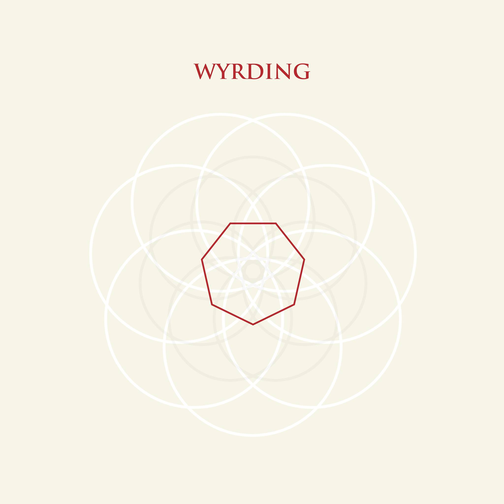

Loyal listeners will have heard the intriguing "Agony In Being" on the [May 2015 Cloudscape](http://www.eveningoflight.nl/2015/05/04/cloudscape-52-may-2015/). Since the release of the EP that track came from, the guys from **Wyrding** have been working on their début album, which is now ready for release on March 1st on **Small Doses.**

While the _Agony In Being_ EP pioneered a unique acoustic doom sound, on their new album the band hew closer to the metal sounds that inspire the band. Channeling the vaguely churchlike energies of a band like **Pantheist**, the first half of the album is dominated by organ keys, lead guitars, and singer Troy Schafer's voice(s), familiar to **Kinit Her** listeners. And a grueling death march pace, of course.

Listen to an exclusive preview of the third track, "False Concept Of Voyage", here:

<iframe src="https://w.soundcloud.com/player/?url=https%3A//api.soundcloud.com/tracks/247439323%3Fsecret_token%3Ds-Tdbue&amp;auto_play=false&amp;hide_related=false&amp;show_comments=true&amp;show_user=true&amp;show_reposts=false&amp;visual=true" width="100%" height="250" frameborder="no" scrolling="no"></iframe>

The second half of the album takes some melodic cues from **Mournful Congregation** and other funeral doom greats, but it retains the intriguing lightness put forward earlier. The result is an ethereal take on funeral doom, warm and mystical, with room to breathe.

The CD version of the album includes the folky _Agony In Being_ as bonus tracks, a good reminder of the further experimental ideas fermenting in this band, although these surface occasionally between the tracks on _Wyrding_ proper, too. They're not afraid to introduce a bit of noise, ghostly voices, or a romantic piano piece.

_Wyrding_ is essential listening, not least because it serves as a forward and upward-looking counterpoint to the neo-traditional efforts of bands like **Pallbearer** and **Bell Witch**. In the by now venerably aged genre of doom metal, there is surely room for both approaches.

If this leaves you craving more, do check out the unnerving video to the album's first track "Poltergeist" over on _[Invisible Oranges](http://www.invisibleoranges.com/wyrding-poltergeist-video-premiere/)_.

[In addition, the band have put together a exclusive 90-minute mix of musical inspirations for us, with artists ranging from **Scott Walker** to **Mercyful Fate**, and **Mark Knopfler** to **Type O Negative**.](http://www.eveningoflight.nl/2016/02/24/cloudscape-dinning-by-wyrding/)

> _Wyrding_ is [available on CD and LP](http://www.small-doses.com/newsblog/?p=1118) from **Small Doses**. You can still get _Agony In Being_ on [the band's Bandcamp](https://wyrding.bandcamp.com/releases).
