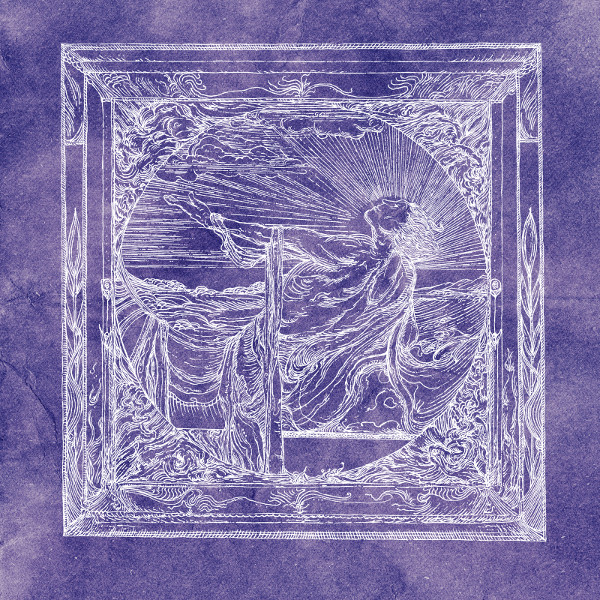

**Kinit Her**, intriguing as ever. The American folk outfit centered around Nathaniel Ritter and Troy Schafer, with the weird vocals, the gorgeous strings, the experiments. It had been a while since the last proper album release, but fans have been kept content with regular tracks and tidbits through the band's Bandcamp subscription program. Now then, there is _The Blooming World_, recorded over the course of the six years before 2015, and the quite a while in the making.

Album starter "Open Shadow" is compellingly composed: a flowing buildup where the various vocalists (Ritter, Schafer, Jessica Way, and Dani Schafer) take turns, backed by swelling strings. The piece then shifts into a rhythmic and delightfully strange denouement with bells, chants, and wolves howling in the distance.

<iframe style="border: 0; width: 100%; height: 120px;" src="https://bandcamp.com/EmbeddedPlayer/album=2933171561/size=large/bgcol=333333/linkcol=2ebd35/tracklist=false/artwork=small/transparent=true/" width="300" height="150" seamless=""><a href="http://kinither.bandcamp.com/album/the-blooming-world">The Blooming World by Kinit Her</a></iframe>

Kinit Her are always seeking the mystical, the hidden; much more occult than a lot of the romantic neofolk we've been getting the past two decades, but also more statuesque and ceremonial than some purveyors of alternative folk. This is quite clear on the four tracks that make up the middle of this album. Driven by acoustic guitar and voice, the songs hint at arcane knowledge, the natural world revealed in a symbolic blossoming.

The title track reintroduces the two female guest vocalists who give the track an eerie, lukewarm blanket. With its bells and string hits, the track reminds me that indeed Kinit Her occasionally venture into **Dead Can Dance** territory: strangely unworldly world music, to use that horribly problematic term.

The album takes leave with "Key Granting Key", a step back into psychedelic territory. The composition feels cyclical, hypnotic, with rich guitars, deep percussion and a string backing, and again the typical Kinit Her vocal sound. If not for those, this track could have come off a late 90s **In Gowan Ring** album, and in my book that's nothing but praise. A lush ending to an album that's short, but perfectly dosed.

_The Blooming World_ is out digitally at the time of writing, and will be released on vinyl by [Pesanta Urfolk](http://pesanta.com/) in the near future.
