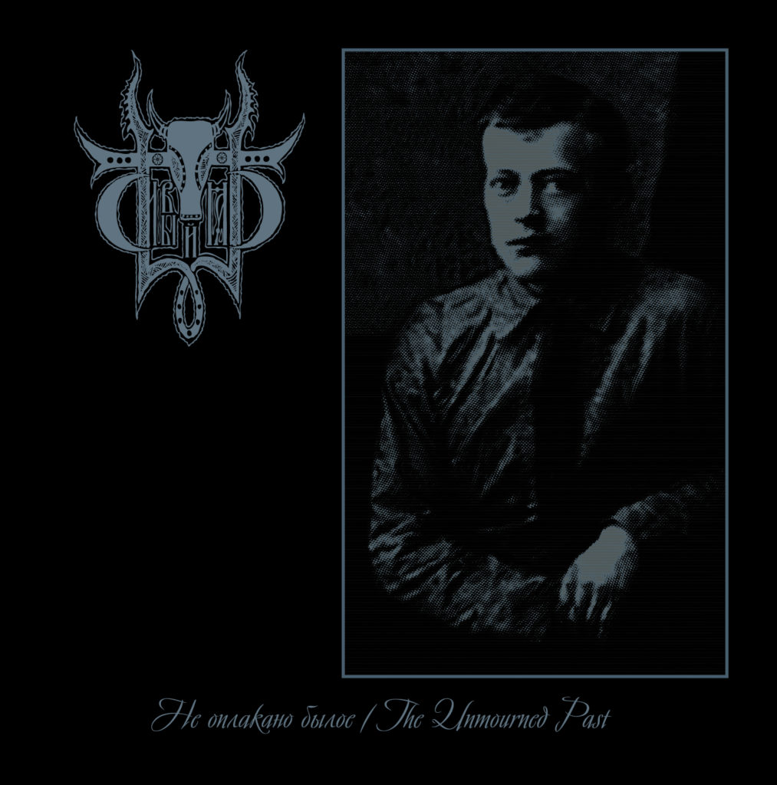

It doesn't look or sound particularly summery—despite being released for the summer solstice—but _The Unmourned Past_ was the soundtrack to quite a few warm nights earlier this year. It's one of those records that make the most of the EP length, filling twenty-two minutes with perfectly proportioned melancholic black metal.

The title suggests that the songs on this EP, like those on earlier albums, might be about Slavic myth and days gone by, but as with much music sung in languages I don't speak—let alone when brought in a kind of ghostly scream–wail—I start to focus more on the general atmosphere, which still is one of loss and sadness. The tempo moves from brisk walks to full gallops; the instrumentarium is warm, with a full bass guitar and sharp riffs offset by subtle string backings; the colours: black and grey.

<iframe style="border: 0; width: 100%; height: 120px;" src="https://bandcamp.com/EmbeddedPlayer/album=3171757817/size=large/bgcol=333333/linkcol=2ebd35/tracklist=false/artwork=small/transparent=true/" width="300" height="150" seamless=""><a href="http://avantgardemusic.bandcamp.com/album/the-unmourned-past">The Unmourned Past by Sivyj Yar</a></iframe>

The EP is darker and more intense than its predecessors, _Burial Shrouds_ and _From The Dead Villages' Darkness_, which took some excellent cues from early Agalloch and Alcest sounds. On those records, sole member Vladimir reserved moments for brighter and gentler sections to offset some of the gloom and melancholy. Here, those moments are absent. We're left with music that channels mental and spiritual strife, without ever opting for the kind of cold or bleak sound that represents the easiest path for black metal to take. For me, it was able to simultaneously express internal struggle, as well as provide the energy necessary to wrestle through it.

However good the earlier works were, _The Unmourned Past_ shows that if Vladimir focuses solely on the compositional elements that are more unique to him, the result is extraordinarily focused and powerful. It's as yet unclear whether the EP is a one-off stylistic excursion, or if it marks a new direction for the project, but if it's the latter, we should be anticipating any coming album even more than usual.
