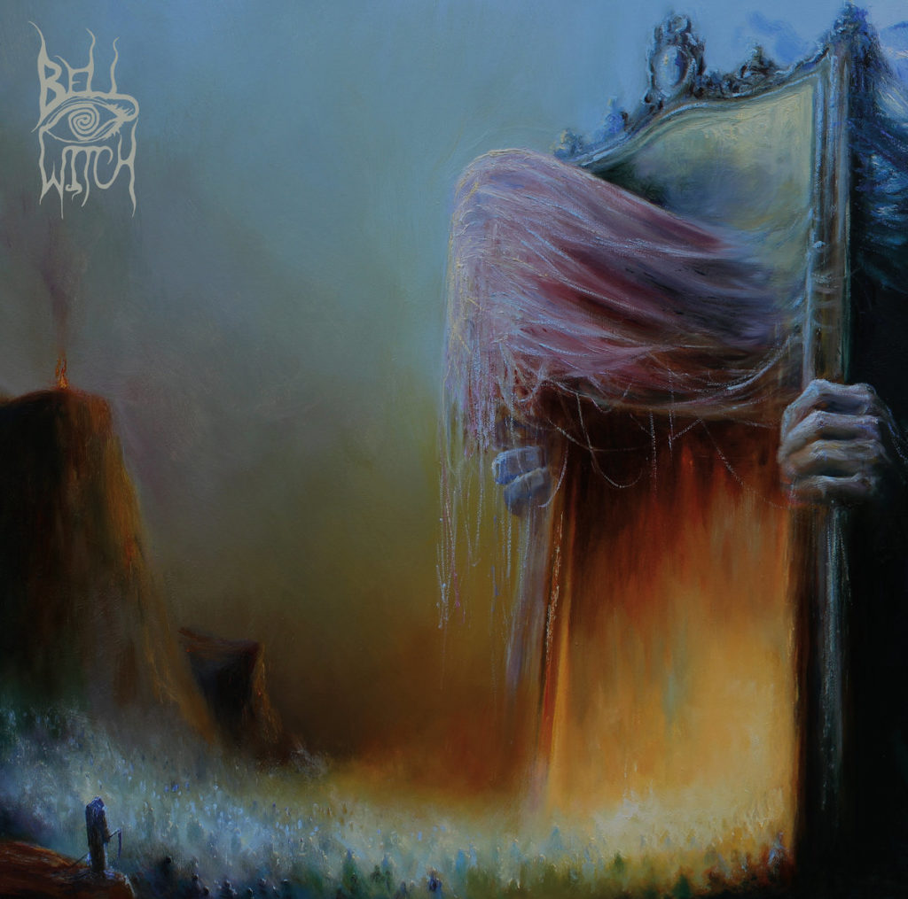
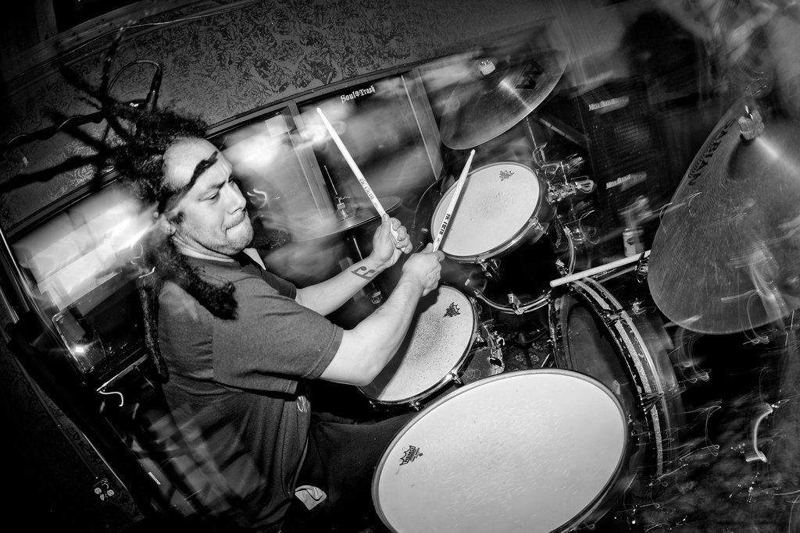
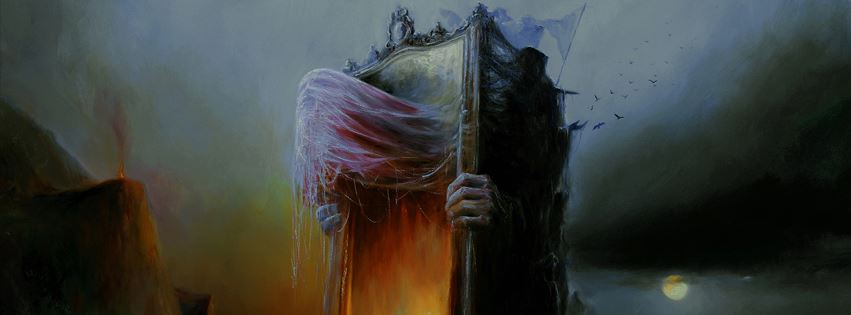

I've been into funeral doom for a while (read: over half of my life at this point). It's the kind of sub-subgenre with a very distinct sound and aesthetic that constantly runs the risk of becoming too rote, to crystallised. For me, it's a thing I sometimes have to forget about for a few years, only to wander back in when the stars are right. **Bell Witch** is the kind of band to make me do that, offering a stripped-down sound that yet retains what we recognise as key features of the genre: a funeral pace, heavy reverberating chords, and the occasional vocal dirge and guitar solo. The funeral world is doom and gloom, it is mournful, but encompasses various kinds of grief: anger, resignation, depression, acceptance. More than any other kind of doom metal, it is about loss: loss of hope, loss of self, and the loss of other people.

It's crystal-clear that _Mirror Reaper_ is a work for Adrian Guerra, one of the band's founding members, who passed away last year. When I saw Bell Witch live in Rotterdam in late 2015, the year _Four Phantoms_ came out, being new to the band, I was surprised to not see Guerra's impressive presence behind the drum kit.

\[caption id="attachment\_5285" align="aligncenter" width="1024"\] Adrian Guerra in action back in the day.\[/caption\]

Alongside bassist/vocalist Dylan Desmond, Jesse Schreibman had already assumed his duties as the new half of the duo, and he did so with conviction. The show was true to the band's core, dragging, kicking, screaming: pure funeral, and as impenetrable live as on recording. Not everyone's cup of tea, in other words, but then again, funeral never was.

_Mirror Reaper_ captures the whole concept of the genre from a number of angles. There's the spaciousness, the mythological approach as expressed by the Beksinskian artwork and the symbolic lyrics. And finally, at the most literal level, there's the sound of a church funeral: the choirs, the organ, the slow procession throughout.

With an album like this, conceived as one massive work — though split into 2 CDs like a proper double gatefold — there are going to be moments when your attention drifts. It's not the kind of songwriting that can or even wants to keep you on the edge of your seat constantly. In that sense, it reminds me of a number of the actual funerals I've attended during my life. You listen to some of the official bits, the speeches, sometimes the music is moving you, and sometimes your mind takes you to other places: memories, of the deceased, of others who have passed, your own mortality...

This isn't the kind of album that pushes boundaries, and in this case that's fine with me. It is a tribute, one that touches upon who Guerra was musically and lyrically, and one where Desmond and Schreibmann mark the passing of a friend, and fellow artist, and perhaps also the band as it used to be and can never be again. As in a real funeral, you forgive the speakers for sometimes taking a bit too long, for choking up, for meandering down an anecdote. That's their way of expressing grief at that one moment. It's fine, we've got our own memories, our own mourning, and it all blends into one.
