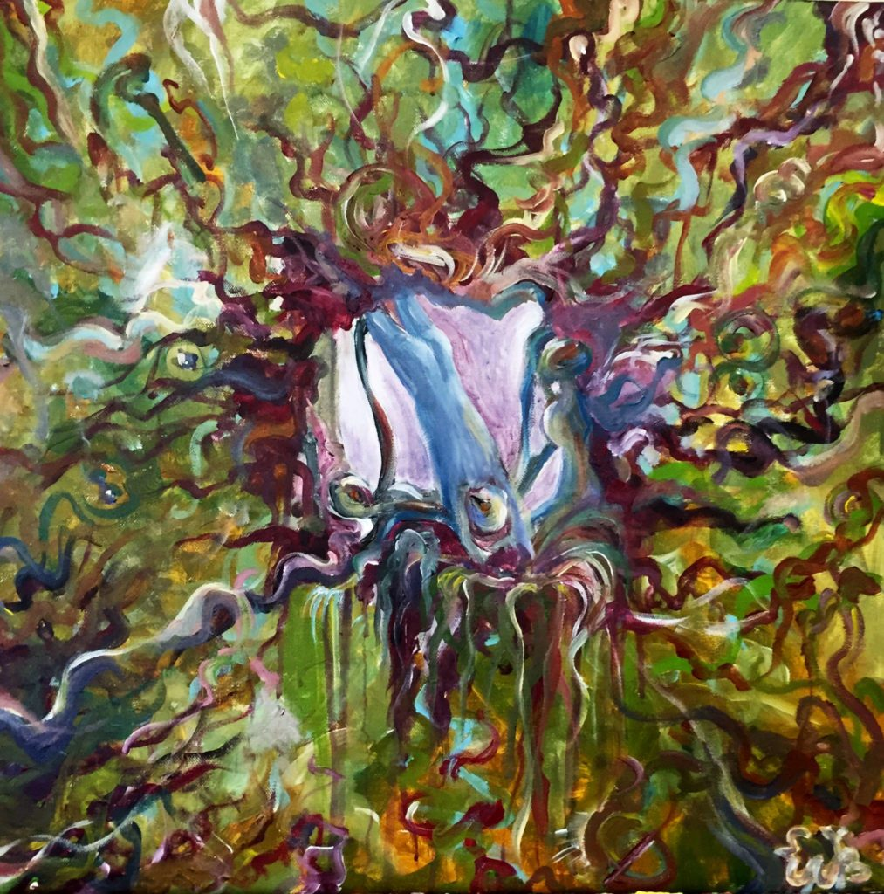

Sometimes the world will chuck things at you that you need. You only have to open your arms and catch.

Those close to me know that I've had a rough two weeks. As always, music is one of the things that pulls me through times like these.

One album in particular that is hitting all the current right spots is _Degeneracy of Nostalgia_ by San Diego-based duo **Sleep White Winter**. Self-describing as "doomgaze", these six tracks take me back to my late teens and early twenties, to grey days soundtracked by the likes of Agalloch, Opeth, Katatonia, Alcest. There is something from each of those lurking in here, laced with a wave-drenched psychedelic guitar sound.

<iframe style="border: 0; width: 100%; height: 120px;" src="https://bandcamp.com/EmbeddedPlayer/album=370397045/size=large/bgcol=333333/linkcol=2ebd35/tracklist=false/artwork=small/transparent=true/" width="300" height="150" seamless=""><a href="http://sleepwhitewinter.bandcamp.com/album/degeneracy-of-nostalgia">Degeneracy of Nostalgia by Sleep White Winter</a></iframe>

Those influences are taken as influences should be: as building blocks for something personal. This is quite clear from the warm, hazy production, from the heartfelt if occasionally wavering vocals, and from the boldly mixed, melodic bass, which is a sure way to get my attention on a metal record. The compositions are varied without risking aimlessness, switching effortlessly from melancholic midtempo rocking to blasting or a softer interlude. Such is the coherence of styles that the cover of **Grey Waters**' "Below the Ever Setting Sun" could well have come from their own oeuvre.

Most importantly, the album has a sense of self-awareness. _Degeneracy of Nostalgia_ feels like a look back at teenage angst; carelessness, and at times carefreeness as well; the kind we get in those moments where we look for something transcendent in the world. It is an ode to both the brittle enthusiasm and mounting depression of youth. It is wholly honest, with all the flaws and beauty that go with that.

Nostalgia is a distorting mirror. But remembering that, being aware of that caveat, we can stare into it occasionally to see things we see nowhere else anymore; not in the same way as we once did.
