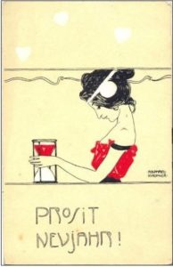

My mini-posts about my favourite 2017 music, gathered for your convenience.

 

Today, looking back on the year. 100% personal, no particular order. Enjoy!

Keep thine eyes peeled & on this here thread.

* * *

United Bible Studies always delivers, and they have been since 2016 in shifting line-ups, as befits a collective. This track, from one of the great A Year In The Country Compilations, represents one side of them.

<iframe style="border: 0; width: 100%; height: 120px;" src="https://bandcamp.com/EmbeddedPlayer/album=3591287251/size=large/bgcol=333333/linkcol=2ebd35/tracklist=false/artwork=small/track=434951406/transparent=true/" seamless=""><a href="http://ayearinthecountry.bandcamp.com/album/all-the-merry-year-round">All The Merry Year Round by United Bible Studies</a></iframe>

But their massive rework of the previously unreleased "The Archaeologists Hands" on the water charity compilation _Water, Water_ takes the cake:

<iframe style="border: 0; width: 100%; height: 120px;" src="https://bandcamp.com/EmbeddedPlayer/album=883519168/size=large/bgcol=333333/linkcol=2ebd35/tracklist=false/artwork=small/track=3616789448/transparent=true/" seamless=""><a href="http://handeye.bandcamp.com/album/water-water">Water, Water by United Bible Studies</a></iframe>

* * *

New York duo ARIADNE fuse visionary religious vocal work with noisy electronics. This one deserves a thorough approach over a longer period as their multimedial release unfolds.

<iframe style="border: 0; width: 100%; height: 120px;" src="https://bandcamp.com/EmbeddedPlayer/album=4189249104/size=large/bgcol=333333/linkcol=2ebd35/tracklist=false/artwork=small/transparent=true/" seamless=""><a href="http://ariadne-music.bandcamp.com/album/stabat-mater">Stabat Mater by ARIADNE</a></iframe>

* * *

2017 was a big vaporwave year for me; a strange meta-genre that draws in various musical aesthetics. It's best known for cheesing nostalgia through retro synths and/or samples, but has since come to encompass a wider range of (electronic) styles. Some of my years favourite releases come from these various musical territories.

Finlii was one of them. Mystic Rhythms & Blue Evening Glass is shimmering, careening set of synth songs that exist somewhere just outside familiarity.

<iframe style="border: 0; width: 100%; height: 120px;" src="https://bandcamp.com/EmbeddedPlayer/album=226247958/size=large/bgcol=333333/linkcol=2ebd35/tracklist=false/artwork=small/transparent=true/" seamless=""><a href="http://adhesivesounds.bandcamp.com/album/mystic-rhythms-blue-evening-glass">Mystic Rhythms &amp; Blue Evening Glass by Finlii</a></iframe>

* * *

While Avantgarde Music puts out a ton of solid metal every year, Wode's second album was one of the highlights of 2017. Black metal with a dollop of old school heavy metal in terms of riffage. See if you can resist…

<iframe style="border: 0; width: 100%; height: 120px;" src="https://bandcamp.com/EmbeddedPlayer/album=81776744/size=large/bgcol=333333/linkcol=2ebd35/tracklist=false/artwork=small/transparent=true/" seamless=""><a href="http://avantgardemusic.bandcamp.com/album/servants-of-the-countercosmos">Servants of the Countercosmos by Wode</a></iframe>

* * *

When it comes to (post-)vapor electronics, Dream Catalogue occupies a central place. Besides various album releases, this year saw the coming of the massive CHAOS tetralogy. Four compilations featuring a ton of excellent material. PWYW!

<iframe style="border: 0; width: 100%; height: 120px;" src="https://bandcamp.com/EmbeddedPlayer/album=1333252348/size=large/bgcol=333333/linkcol=2ebd35/tracklist=false/artwork=small/transparent=true/" seamless=""><a href="http://dreamcatalogue.bandcamp.com/album/chaos-1-nirvana-is-leaking-into-the-mainframe">CHAOS 1: Nirvana Is Leaking Into The Mainframe by Dream Catalogue</a></iframe>

 

<iframe style="border: 0; width: 100%; height: 120px;" src="https://bandcamp.com/EmbeddedPlayer/album=504164074/size=large/bgcol=333333/linkcol=2ebd35/tracklist=false/artwork=small/transparent=true/" seamless=""><a href="http://dreamcatalogue.bandcamp.com/album/chaos-2-a-golden-halo-underground">CHAOS 2: A Golden Halo Underground by Dream Catalogue</a></iframe>

 

<iframe style="border: 0; width: 100%; height: 120px;" src="https://bandcamp.com/EmbeddedPlayer/album=4133590733/size=large/bgcol=333333/linkcol=2ebd35/tracklist=false/artwork=small/transparent=true/" seamless=""><a href="http://dreamcatalogue.bandcamp.com/album/chaos-3-the-layers-of-our-dreams-interwoven">CHAOS 3: The Layers Of Our Dreams Interwoven by Dream Catalogue</a></iframe>

 

<iframe style="border: 0; width: 100%; height: 120px;" src="https://bandcamp.com/EmbeddedPlayer/album=1456828687/size=large/bgcol=333333/linkcol=2ebd35/tracklist=false/artwork=small/transparent=true/" seamless=""><a href="http://dreamcatalogue.bandcamp.com/album/chaos-4-we-are-unstoppable">CHAOS 4: We Are Unstoppable by Dream Catalogue</a></iframe>

* * *

Full Spectrum had another good year. One very fine album is Golconda's 25 to 40, ten summery, glittering tracks pairing guitar with synths, Rhodes, etc.

<iframe style="border: 0; width: 100%; height: 120px;" src="https://bandcamp.com/EmbeddedPlayer/album=564817439/size=large/bgcol=333333/linkcol=2ebd35/tracklist=false/artwork=small/transparent=true/" seamless=""><a href="http://fullspectrumrecords.bandcamp.com/album/25-to-40">25 to 40 by Golconda</a></iframe>

* * *

Adhesive Sounds' summer compilation was the gateway to some of the vaporwave artists I've come to enjoy: i.a. b o d y l i n e, TVVIN\_PINEZ\_M4LL, and Trademarks & Copyrights. Maybe this nice collection can serve a similar function for you. It's free!

<iframe style="border: 0; width: 100%; height: 120px;" src="https://bandcamp.com/EmbeddedPlayer/album=4061486839/size=large/bgcol=333333/linkcol=2ebd35/tracklist=false/artwork=small/transparent=true/" seamless=""><a href="http://adhesivesounds.bandcamp.com/album/adhesive-sounds-schools-out-summer-sampler-2017">Adhesive Sounds School's Out Summer Sampler 2017 by Various Artists</a></iframe>

* * *

Speaking of, EXOSPHERE is another great conceptual vapor comp that shows the breadth of the scene. Tracks by finlii, 猫 シ Corp., et al. Pay close attention to this superb Yoshimi track that featured in an earlier Cloudscape.

<iframe style="border: 0; width: 100%; height: 120px;" src="https://bandcamp.com/EmbeddedPlayer/album=2436278290/size=large/bgcol=333333/linkcol=2ebd35/tracklist=false/artwork=small/track=2353734206/transparent=true/" seamless=""><a href="http://sunsetrecordings.bandcamp.com/album/exosphere">EXOSPHERE by Yoshimi</a></iframe>

* * *

From the very start of the year, Ocoeur's Reversed remix EP was an early highlight. Beautiful ambient works, particularly the Julien Machal piano rework.

<iframe style="border: 0; width: 100%; height: 120px;" src="https://bandcamp.com/EmbeddedPlayer/album=3292719265/size=large/bgcol=333333/linkcol=2ebd35/tracklist=false/artwork=small/transparent=true/" seamless=""><a href="http://n5md.bandcamp.com/album/reversed-remixes">Reversed - Remixes by Ocoeur</a></iframe>

* * *

I anticipated this one since the teasing of its second track months before release. The whole self-titled Tchornobog album does not disappoint. Lush, cerebral, oneiric, doom-laden, brutal death metal.

<iframe style="border: 0; width: 100%; height: 120px;" src="https://bandcamp.com/EmbeddedPlayer/album=1654484056/size=large/bgcol=333333/linkcol=2ebd35/tracklist=false/artwork=small/transparent=true/" seamless=""><a href="http://i-voidhangerrecords.bandcamp.com/album/tchornobog">Tchornobog by TCHORNOBOG</a></iframe>

* * *

Staying in the extreme metal zone for a bit, Battle Dagorath impressed once more with their latest album. Surge into the darkest depths of outer space on waves black metal riffs and synthscapes.

<iframe style="border: 0; width: 100%; height: 120px;" src="https://bandcamp.com/EmbeddedPlayer/album=2116106695/size=large/bgcol=333333/linkcol=2ebd35/tracklist=false/artwork=small/transparent=true/" seamless=""><a href="http://avantgardemusic.bandcamp.com/album/ii-frozen-light-of-eternal-darkness">II - Frozen Light of Eternal Darkness by Battle Dagorath</a></iframe>

* * *

Gothing it up is essential, too. This year, we had that amply covered by Hante. with her lovely latest darkwave/synthpop album Between Hope & Danger.

<iframe style="border: 0; width: 100%; height: 120px;" src="https://bandcamp.com/EmbeddedPlayer/album=4144184149/size=large/bgcol=333333/linkcol=2ebd35/tracklist=false/artwork=small/transparent=true/" seamless=""><a href="http://hante.bandcamp.com/album/between-hope-danger">Between Hope &amp; Danger by Hante.</a></iframe>

* * *

Some more vapors, then. Trademarks & Copyrights put out some juicy babewave this year. Are you living in a life of luxury?

<iframe style="border: 0; width: 100%; height: 120px;" src="https://bandcamp.com/EmbeddedPlayer/album=1511670006/size=large/bgcol=333333/linkcol=2ebd35/tracklist=false/artwork=small/track=2370844732/transparent=true/" seamless=""><a href="http://adhesivesounds.bandcamp.com/album/so-hot">So Hot by Trademarks &amp; Copyrights</a></iframe>

Can you make the twist?

<iframe style="border: 0; width: 100%; height: 120px;" src="https://bandcamp.com/EmbeddedPlayer/album=858320030/size=large/bgcol=333333/linkcol=2ebd35/tracklist=false/artwork=small/track=1686670584/transparent=true/" seamless=""><a href="http://trademarksandcopyrights.bandcamp.com/album/black-white">Black &amp; White by Trademarks &amp; Copyrights</a></iframe>

* * *

Ambient shouldn't go missing from this overview. First of all, Jason van Wyk's two gorgeous albums on Home Normal, of which I'm highlighting 'Opacity' here. The perfect balance between piano and electronica.

<iframe style="border: 0; width: 100%; height: 120px;" src="https://bandcamp.com/EmbeddedPlayer/album=3492681571/size=large/bgcol=333333/linkcol=2ebd35/tracklist=false/artwork=small/transparent=true/" seamless=""><a href="http://homenormal.bandcamp.com/album/opacity">Opacity by Jason van Wyk</a></iframe>

* * *

And on Winter-Light, the soothing and superb 'The Radiant Sea' by Bridge To Imla, exploring the eco- and psychological depths of the Pacific.

<iframe style="border: 0; width: 100%; height: 120px;" src="https://bandcamp.com/EmbeddedPlayer/album=224796053/size=large/bgcol=333333/linkcol=2ebd35/tracklist=false/artwork=small/transparent=true/" seamless=""><a href="http://winter-light.bandcamp.com/album/the-radiant-sea">The Radiant Sea by Bridge To Imla</a></iframe>

* * *

And an honorable mention for Tobias Hellkvist's divine 'Kaskelot', strictly an older EP, but reissued this year with great new remixes by lovely people like Porya Hatami and Chihei Hatakeyama. Again on Home Normal.

<iframe style="border: 0; width: 100%; height: 120px;" src="https://bandcamp.com/EmbeddedPlayer/album=1646831201/size=large/bgcol=333333/linkcol=2ebd35/tracklist=false/artwork=small/transparent=true/" seamless=""><a href="http://homenormal.bandcamp.com/album/kaskelot-reissue-remixes">Kaskelot: Reissue + Remixes by Tobias Hellkvist</a></iframe>

* * *

A late discovery, mentioned earlier this week, is Legendry's 'Dungeon Crawler': modern day channeling of the epic fantasy current in heavy metal. Say no more! Plus it's got a drum solo; those are rare nowadays.

<iframe style="border: 0; width: 100%; height: 120px;" src="https://bandcamp.com/EmbeddedPlayer/album=482198708/size=large/bgcol=333333/linkcol=2ebd35/tracklist=false/artwork=small/transparent=true/" seamless=""><a href="http://legendry.bandcamp.com/album/dungeon-crawler">Dungeon Crawler by Legendry</a></iframe>

* * *

After all these years, I'm still a doomhead as well. Bell Witch's latest was emotionally draining but sincerely beautiful. My review: [http://www.eveningoflight.nl/2017/10/20/mirror-reaper/](http://www.eveningoflight.nl/2017/10/20/mirror-reaper/)

* * *

And perhaps an obvious addition, but I \*did\* enjoy Pallbearer's latest a whole bunch as well. It is, for lack of a better word, mature. And ends on what is one of the band's finest tracks to date: "A Plea for Understanding".

<iframe style="border: 0; width: 100%; height: 120px;" src="https://bandcamp.com/EmbeddedPlayer/album=4268244820/size=large/bgcol=333333/linkcol=2ebd35/tracklist=false/artwork=small/track=3675311338/transparent=true/" seamless=""><a href="http://profoundlorerecords.bandcamp.com/album/heartless">Heartless by PALLBEARER</a></iframe>

* * *

Heading into the darkness. Yoshimi's 'Atavism' on Dream Catalogue was delectable, but don't forget about the second instalment of 'Japanese Ghosts'. It's heavy, it's noisy, it's got beats, and those titular ghosts are \*present\*.

<iframe style="border: 0; width: 100%; height: 120px;" src="https://bandcamp.com/EmbeddedPlayer/album=2020981250/size=large/bgcol=333333/linkcol=2ebd35/tracklist=false/artwork=small/transparent=true/" seamless=""><a href="http://pyramidslabel.bandcamp.com/album/japanese-ghosts-ii">Japanese Ghosts II by Yoshimi</a></iframe>

* * *

raison d'être & Troum prove once more that they're a match made in heaven. XIBIPIIO fuses the best of both their typical sounds: drones, waves, and rhythms from the deepest reaches of the mind.

<iframe style="border: 0; width: 100%; height: 120px;" src="https://bandcamp.com/EmbeddedPlayer/album=2628933434/size=large/bgcol=333333/linkcol=2ebd35/tracklist=false/artwork=small/transparent=true/" seamless=""><a href="http://troum.bandcamp.com/album/xibipiio-in-and-out-of-experience-cd-2017">Xibipiio. In and Out of Experience (CD, 2017) by raison d'etre &amp; TROUM</a></iframe>

* * *

Morgen Wurde took his craft to the next level with an album that can only be described as a detective thriller through the medium of dark jazzy soundscapes. There's a body, a motive, a murder weapon. Can you piece together what happened?

<iframe style="border: 0; width: 100%; height: 120px;" src="https://bandcamp.com/EmbeddedPlayer/album=1596616078/size=large/bgcol=333333/linkcol=2ebd35/tracklist=false/artwork=small/transparent=true/" seamless=""><a href="http://timereleasedsound.bandcamp.com/album/assassinous-act">Assassinous Act by Morgen Wurde</a></iframe>

* * *

Lovers of original compositions can always count on polymath Cosmo D. The soundtrack for his latest game The Norwood Suite is another critical hit. Check into the hotel, where the music is jazz through an electronic looking glass.

<iframe style="border: 0; width: 100%; height: 120px;" src="https://bandcamp.com/EmbeddedPlayer/album=3964924440/size=large/bgcol=333333/linkcol=2ebd35/tracklist=false/artwork=small/transparent=true/" seamless=""><a href="http://cosmoddd.bandcamp.com/album/the-norwood-suite-soundtrack">The Norwood Suite Soundtrack by Cosmo D</a></iframe>

* * *

The final metal mention for today is Sleep White Winter's heartfelt and original dissection of nostalgia. It's superbly melancholic nineties and aughties dark metal, but with today's self-awareness. My review: [http://www.eveningoflight.nl/2017/11/29/degeneracy-of-nostalgia/](http://www.eveningoflight.nl/2017/11/29/degeneracy-of-nostalgia/)

* * *

When unlikely influences merge in one mind, the result can be breathtaking. Joonatan Aaltonen merges his trademark Finnish acoustic neofolk with synth melodies harkening back to fantasy game soundtracks. Right up my alley.

<iframe style="border: 0; width: 100%; height: 120px;" src="https://bandcamp.com/EmbeddedPlayer/album=3599363240/size=large/bgcol=333333/linkcol=2ebd35/tracklist=false/artwork=small/transparent=true/" seamless=""><a href="http://kiiltomatolyhty.bandcamp.com/album/unikirja-i">Unikirja I by Kiiltomatolyhty</a></iframe>

* * *

And finally, Andrew Weathers wrote what is probably my favourite song of the year: I Am Left Buried Where I've Been. It's been a source of solace constantly since I first heard it, and the highlight of an already lovely album. <3

<iframe style="border: 0; width: 100%; height: 120px;" src="https://bandcamp.com/EmbeddedPlayer/album=756970451/size=large/bgcol=333333/linkcol=2ebd35/tracklist=false/artwork=small/transparent=true/" seamless=""><a href="http://andrewweathers.bandcamp.com/album/build-a-mountain-where-our-bodies-fall">Build A Mountain Where Our Bodies Fall by Andrew Weathers Ensemble</a></iframe>

* * *

That's it for 2017 as far as I can see right now. The year was rough on me, but these are some of the things that pulled me through. Thanks for sharing it with me.
