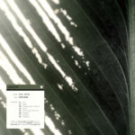

For your convenience, especially those who don't stay up to date with social media, here are last week's blurbs for interesting albums to check out!

If you'd like to get them while they're hot, [follow our updates on Twitter](https://www.twitter.com/eveningoflight), or [join the community on our Discord](https://discord.gg/RnE2U5Y).

* * *

Chopped up words and sounds, percussions, on this experimental 1980 piece by Jerry Hunt: _From "Ground"_.

Out this week on Other Minds.

<iframe style="border: 0; width: 100%; height: 120px;" src="https://bandcamp.com/EmbeddedPlayer/album=2531114297/size=large/bgcol=333333/linkcol=2ebd35/tracklist=false/artwork=small/transparent=true/" seamless=""><a href="http://othermindsrecords.bandcamp.com/album/from-ground">from "Ground" by Jerry Hunt</a></iframe>

* * *

Whaddya know, there's an actual new Evening of Light release!

Dark synths galore on this one...

<iframe style="border: 0; width: 100%; height: 120px;" src="https://bandcamp.com/EmbeddedPlayer/album=2123444787/size=large/bgcol=333333/linkcol=2ebd35/tracklist=false/artwork=small/transparent=true/" seamless=""><a href="http://eveningoflight.bandcamp.com/album/ex-abyss-i">Ex Abyssō I by Evening of Light</a></iframe>

* * *

Utred's _Tribute II_ is a dungeon synth cover album. His selection is very tight, drawing metal, soundtracks, new age, prog together into a remarkably cohesive sound.

Oh, and it has "Africa". Get in there!

<iframe style="border: 0; width: 100%; height: 120px;" src="https://bandcamp.com/EmbeddedPlayer/album=2162315147/size=large/bgcol=333333/linkcol=2ebd35/tracklist=false/artwork=small/transparent=true/" seamless=""><a href="http://utred.bandcamp.com/album/tribute-ii">Tribute II by Utred</a></iframe>

* * *

Turns out that I should be digging deeper into Bart Graft's discography.

_Empyrean_ is an astonishing mix of dream rock, new age, and synthy pop.

Dig in!

<iframe style="border: 0; width: 100%; height: 120px;" src="https://bandcamp.com/EmbeddedPlayer/album=2963993027/size=large/bgcol=333333/linkcol=2ebd35/tracklist=false/artwork=small/transparent=true/" seamless=""><a href="http://bartgraft.bandcamp.com/album/empyrean">Empyrean by Bart Graft</a></iframe>

* * *

Oldie. Goodie. Freebie.

con\_cetta's _sclerosis_ (2008) is a subtle, organic ambient record. soft bells, waves, crackles, beats.

Free lossless: [http://www.zymogen.net/releases/zym019/](http://www.zymogen.net/releases/zym019/)

* * *

All of Business Casual's _Digital Office_ releases are stellar, and the fourth one (2016) is no exception.

Funky upbeat electronics from start to finish.

<iframe style="border: 0; width: 100%; height: 120px;" src="https://bandcamp.com/EmbeddedPlayer/album=2904518974/size=large/bgcol=333333/linkcol=2ebd35/tracklist=false/artwork=small/transparent=true/" seamless=""><a href="http://music.businesscasual.biz/album/digital-office-four">Digital Office Four by Various Artists</a></iframe>
