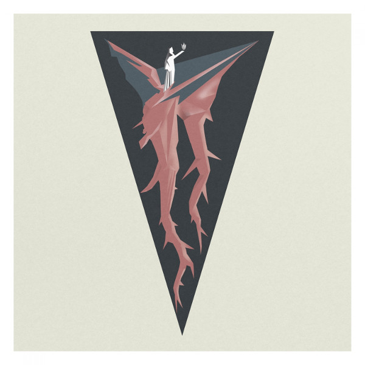

Dark. Cold. Winds. **Ugasanie** in familar, icy territory.

<iframe style="border: 0; width: 100%; height: 120px;" src="https://bandcamp.com/EmbeddedPlayer/album=1724037790/size=large/bgcol=ffffff/linkcol=333333/tracklist=false/artwork=small/transparent=true/" seamless=""><a href="http://cryochamber.bandcamp.com/album/ice-breath-of-antarctica">Ice Breath of Antarctica by Ugasanie</a></iframe>

* * *

**Tarpan**'s crusty death metal is delish. Thick as gravy, and groovy too.

_Бездна (The abyss)_ - literally bottomless.

These Russians mean business, and Goddess knows I'm buying what they're selling.

<iframe style="border: 0; width: 100%; height: 120px;" src="https://bandcamp.com/EmbeddedPlayer/album=3412313856/size=large/bgcol=ffffff/linkcol=333333/tracklist=false/artwork=small/transparent=true/" seamless=""><a href="http://tarpancrust.bandcamp.com/album/the-abyss">Бездна (The abyss) by Tarpan</a></iframe>

* * *

**LemKuuja** is a producer from Jordan, and _Cheesecake+_ (2018, Business Casual) is his latest album of future-funky tunes.

He's perhaps one of the best people working in the genre currently. A master's touch in grooves and hooks.

<iframe style="border: 0; width: 100%; height: 120px;" src="https://bandcamp.com/EmbeddedPlayer/album=298086636/size=large/bgcol=ffffff/linkcol=de270f/tracklist=false/artwork=small/transparent=true/" seamless=""><a href="http://music.businesscasual.biz/album/cheesecake">CHEESECAKE+ by LemKuuja</a></iframe>

* * *

Late night dreaming. Guitars under the Ukrainian leaves, critters all around. And the wind caressing gently.

**Gamardah Fungus** channel the ancient magic of herbs through their signature organic ambient.

<iframe style="border: 0; width: 100%; height: 120px;" src="https://bandcamp.com/EmbeddedPlayer/album=596799299/size=large/bgcol=ffffff/linkcol=aa9977/tracklist=false/artwork=small/transparent=true/" seamless=""><a href="http://gamardahfungus.bandcamp.com/album/herbs-and-potions">HERBS AND POTIONS by Gamardah Fungus</a></iframe>

* * *

Supreme chill with **TAO-net**'s #naturewave. Looks like _biomes(systems)_ is the project's only release — sadface.

This one has it all, though: the softest synth instruments, a touch of new age vocals through the filters of time and space.

<iframe style="border: 0; width: 100%; height: 120px;" src="https://bandcamp.com/EmbeddedPlayer/album=891857124/size=large/bgcol=ffffff/linkcol=63b2cc/tracklist=false/artwork=small/transparent=true/" seamless=""><a href="http://taonet.bandcamp.com/album/biomes-systems">biomes(systems) by TAO_net</a></iframe>

* * *

Thumping minimal noise on _Sokyra_ by **Kotra** vs **Edward Sol**.

The dirty heartbeat of a riot, or a revolution?

Four axes to grind.

<iframe style="border: 0; width: 100%; height: 120px;" src="https://bandcamp.com/EmbeddedPlayer/album=4268151871/size=large/bgcol=ffffff/linkcol=e99708/tracklist=false/artwork=small/transparent=true/" seamless=""><a href="http://kvitnu.bandcamp.com/album/sokyra">Sokyra by Kotra vs Edward Sol</a></iframe>

* * *

Avantgarde Music is reissuing **Throne of Ahaz**'s _On Twilight Enthroned_ from 1996.

Hadn't heard it before, but it's a proper classic of mid 90s black metal. Not overly raw or gritty, with a nice rocking groove.

<iframe style="border: 0; width: 100%; height: 120px;" src="https://bandcamp.com/EmbeddedPlayer/album=880939337/size=large/bgcol=ffffff/linkcol=7137dc/tracklist=false/artwork=small/transparent=true/" seamless=""><a href="http://avantgardemusic.bandcamp.com/album/on-twilight-enthroned">On Twilight Enthroned by Throne of Ahaz</a></iframe>

* * *

Spacious spiritual drones by **Nam-Khar** on _Secret Essence · Sangwa Dupa_, which came out this year on Winter Light.

Plenty of breathing room for scattered drum hits, rattles, chimes.

Excellent! Full review in the next issue of [_Ex Abyssō_](http://www.eveningoflight.nl/exabysso).

<iframe style="border: 0; width: 100%; height: 120px;" src="https://bandcamp.com/EmbeddedPlayer/album=3096451807/size=large/bgcol=ffffff/linkcol=e99708/tracklist=false/artwork=small/transparent=true/" seamless=""><a href="http://winter-light.bandcamp.com/album/secret-essence-sangwa-dupa">Secret Essence/Sangwa Dupa by Nam-Khar</a></iframe>

* * *

On their latest album _Semmiből - a semmin át_, **Agregator** (HUN) serve up melodic death metal of the turn of the century kind.

Not terribly original, and I'm not 100% convinced on the vocals, but there definitely are some top-notch riffs and solos in here.

<iframe style="border: 0; width: 100%; height: 120px;" src="https://bandcamp.com/EmbeddedPlayer/album=671375481/size=large/bgcol=ffffff/linkcol=333333/tracklist=false/artwork=small/transparent=true/" seamless=""><a href="http://agregator.bandcamp.com/album/semmib-l-a-semmin-t">Semmiből - a semmin át by Agregator</a></iframe>

* * *

Surfpunk? Beachwave? Who cares, dude. Just grab one of the big waves. Tubular!

This one's got, like, a bunch of gnarly songs. Don't let the great white bite!

<iframe style="border: 0; width: 100%; height: 120px;" src="https://bandcamp.com/EmbeddedPlayer/album=1937871403/size=large/bgcol=ffffff/linkcol=de270f/tracklist=false/artwork=small/transparent=true/" seamless=""><a href="http://palm84.bandcamp.com/album/kahuna-kill-64">Kahuna Kill &#39;64 by Various Artists</a></iframe>

* * *

**Taphephobia**'s ambient takes us deep into Northern forests, where we find—unexpectedly—calm, and warmth.

_Ghostwood_ is between worlds, and so are we when we are in it.

Slightly brighter than usual for Cyclic Law fare; a strong addition to the roster.

<iframe style="border: 0; width: 100%; height: 120px;" src="https://bandcamp.com/EmbeddedPlayer/album=655114727/size=large/bgcol=ffffff/linkcol=63b2cc/tracklist=false/artwork=small/transparent=true/" seamless=""><a href="http://cycliclaw.bandcamp.com/album/ghostwood">Ghostwood by TAPHEPHOBIA</a></iframe>

* * *

**A Veil of Water** really hits the spot with this collection of calm melodies.

_Late Night Loneliness_ came out this summer on Hidden Vibes and has a supremely relaxing blend of ambient and post-rockish sounds.

Piano, guitar, rhodes, the occasional whisper. The kind of chords for when you need something soothing and familiar.

<iframe style="border: 0; width: 100%; height: 120px;" src="https://bandcamp.com/EmbeddedPlayer/album=1539028543/size=large/bgcol=ffffff/linkcol=e99708/tracklist=false/artwork=small/transparent=true/" seamless=""><a href="http://hiddenvibes.bandcamp.com/album/late-night-loneliness">Late Night Loneliness by A Veil Of Water</a></iframe>

* * *

I'm of a dark mind this morning, and trying to exorcise.

**Twilight Fauna**'s EP _Therapeutic Landscapes_ is getting me part of the way. Scathing ambient black metal and spirituals.

My head's still bowed, but there's a spark of determination there now.

<iframe style="border: 0; width: 100%; height: 120px;" src="https://bandcamp.com/EmbeddedPlayer/album=1878098021/size=large/bgcol=ffffff/linkcol=1133ff/tracklist=false/artwork=small/transparent=true/" seamless=""><a href="http://twilightfauna.bandcamp.com/album/therapeutic-landscapes">Therapeutic Landscapes by Twilight Fauna</a></iframe>

* * *

We know Business Casual for their top shelf vaporwave releases, but I bet they didn't think twice about releasing this slab of dark synth EBM by **White Gavri'el**.

_Vista of Chaos_ has plenty of danceable tracks, but also takes the time to experiment. Stellar.

<iframe style="border: 0; width: 100%; height: 120px;" src="https://bandcamp.com/EmbeddedPlayer/album=37646491/size=large/bgcol=ffffff/linkcol=333333/tracklist=false/artwork=small/transparent=true/" seamless=""><a href="http://music.businesscasual.biz/album/vista-of-chaos">Vista of Chaos by White Gavri&#39;el</a></iframe>

* * *

On _Jupiter's Immigrants_ [**The Moor**](https://themoor.org/) serve up nine tracks of prog metal with black/death influences.

Chorus-based with plenty of nice hooks and solos, incl. a cameo by Dark Tranquility's Mikael Stanne. Pretty slick, but it sticks.

\[no bandcamp\]

* * *

If you liked **Ikjoyce**'s work on [_Ex Abyssō_ I](http://www.eveningoflight.nl/exabysso/2018/08/01/ex-abysso-i-august-2018/), you'll love _Selene_, this year's album on Naviar Records.

Meditative ambient synth, darker and lighter moments, and continued lunar themes. Always a plus for me.

<iframe style="border: 0; width: 100%; height: 120px;" src="https://bandcamp.com/EmbeddedPlayer/album=244181057/size=large/bgcol=ffffff/linkcol=333333/tracklist=false/artwork=small/transparent=true/" seamless=""><a href="http://naviarrecords.bandcamp.com/album/selene">Selene by ikjoyce</a></iframe>
