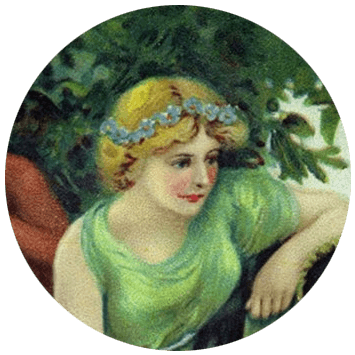
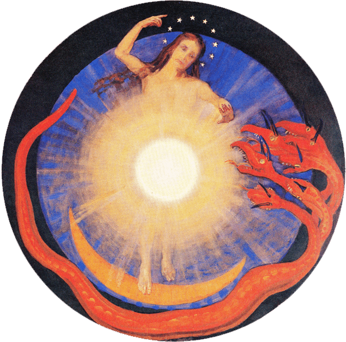

<iframe style="border: 0; width: 600px; height: 600px;" src="https://bandcamp.com/EmbeddedPlayer/album=2838511816/size=large/bgcol=ffffff/linkcol=333333/minimal=true/transparent=true/" seamless=""><a href="http://ratskinrecords.bandcamp.com/album/wizard-apprentice-i-am-invisible">WIZARD APPRENTICE &quot;I Am Invisible&quot; by Ratskin Records</a></iframe>

* * *

**Wizard** Apprentice  
_I Am Invisible_  
2018, Ratskin Records

I was planning on calling this a fragile album, but it is anything but. This is because when we acknowledge and display our vulnerabilities, we have already conquered them in part, and are less fragile as a result.

Wizard Apprentice's music is based around synth and voice, with an occasional role for guitar. The label's description of her as "a digital folk artist" is quite apt. If anything, the simple, effective setup of the sound reminds me of **Martyn Bates**’ _Letters Written_ (both I and II)—the voice is different, obviously, though at times less so than you might expect.

_I am Invisible_ is about (not) standing out, hurting and being hurt, feeling and not feeling, different ways of being (in)visbile, the struggle of the introvert in communicating emotions:

> Sensuality is a moment captured in a picture  
> I know it when I see it when I'm looking at myself  
> I know it when I see it  
> I'm feeling it, does it look like I'm feeling it?  
> Will you tell me if it looks like I'm feeling it? 

These lyrics are from "Sensuality", one of the album's most piercing tracks. I'm also partial to the slightly more hopeful melody of "Research Stage of Love"—brilliant title, that. The folksy "As If" is an extended closer, slipping into some great experimental concrète synth near the end.

Contemplative and deeply melancholic, _I am Invisible_ is a bravely personal album, almost like an aural diary. She styles herself as an apprentice, but in my book, she's _this_ close to becoming an adept synth poetry magician.

* * *

### _Reviewed by [Ἀρέθουσα](http://www.eveningoflight.nl/category/muses/%e1%bc%80%cf%81%ce%ad%ce%b8%ce%bf%cf%85%cf%83%ce%b1/) and [voidassembly progenitrix v∞](http://www.eveningoflight.nl/category/muses/voidassembly_progenitrix_v%e2%88%9e/)_
