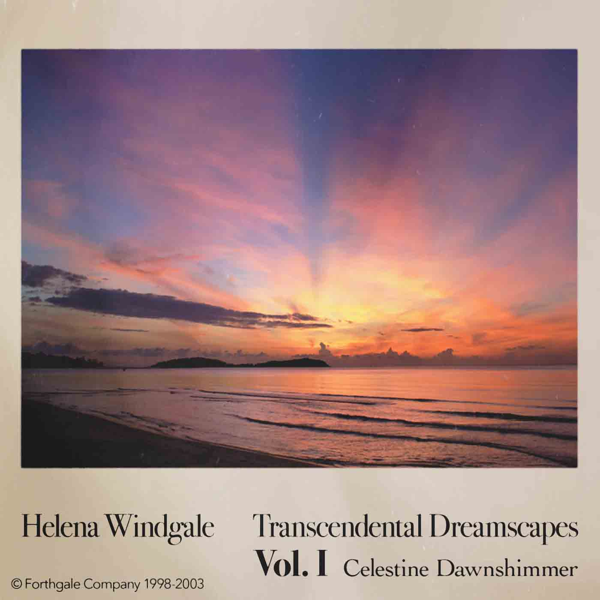

* * *

First of all, have a read over at [my review](http://www.eveningoflight.nl/2018/10/27/valyri-phases/) of **valyri**’s _Phases_, if you haven't already.

<iframe style="border: 0; width: 100%; height: 42px;" src="https://bandcamp.com/EmbeddedPlayer/album=1996019215/size=small/bgcol=333333/linkcol=9a64ff/transparent=true/" seamless=""><a href="http://hairsablazin.bandcamp.com/album/phases">Phases by valyri</a></iframe>

* * *

One of my faves from back in the day, **Agitated Radio Pilot**’s _Last Orders at the One Tree Hotel_

<iframe style="border: 0; width: 600px; height: 600px;" src="https://bandcamp.com/EmbeddedPlayer/album=361089055/size=large/bgcol=333333/linkcol=ffffff/minimal=true/transparent=true/" seamless=""><a href="http://agitatedradiopilot.bandcamp.com/album/last-orders-at-the-one-tree-hotel">Last Orders At The One Tree Hotel by Agitated Radio Pilot</a></iframe>

* * *

And if you need even more gorgeous, serene synths after that **valyri** review, join me over here, _Raised High in Badwater Basin_ by **Andrew Weathers** (2014).

<iframe style="border: 0; width: 600px; height: 600px;" src="https://bandcamp.com/EmbeddedPlayer/album=1382543955/size=large/bgcol=ffffff/linkcol=0687f5/minimal=true/transparent=true/" seamless=""><a href="http://andrewweathers.bandcamp.com/album/raised-high-in-badwater-basin">Raised High in Badwater Basin by Andrew Weathers</a></iframe>

* * *

**Beast Nest**'s organic ambient is a true delight. 2016's _Taste of India_ (Ratskin Records) features two long tracks that take their proper time to unfold, at once digital and animal, cradling you in effervescence and warmth.

<iframe style="border: 0; width: 600px; height: 600px;" src="https://bandcamp.com/EmbeddedPlayer/album=2755394655/size=large/bgcol=ffffff/linkcol=63b2cc/minimal=true/transparent=true/" seamless=""><a href="http://ratskinrecords.bandcamp.com/album/taste-of-india">&quot;Taste Of India&quot; by BEAST NEST</a></iframe>

* * *

Superb ritual ambient on **Dreyt Nien**'s _The Prismatic Pyramids_ (2018, Hairs aBlazin'). This is naturetech at its finest: tabla, sitar, alien voices, bells, heavy synths, the works. Two tracks of massive proportions and ditto impact.

<iframe style="border: 0; width: 600px; height: 600px;" src="https://bandcamp.com/EmbeddedPlayer/album=1682562514/size=large/bgcol=ffffff/linkcol=2ebd35/minimal=true/transparent=true/" seamless=""><a href="http://hairsablazin.bandcamp.com/album/the-prismatic-pyramids">The Prismatic Pyramids by Dreyt Nien</a></iframe>

* * *

My second review for this period was _[The Sea of Potentials](http://www.eveningoflight.nl/2018/11/03/dronny-darko-and-apollonius-the-sea-of-potentials/)_ [by](http://www.eveningoflight.nl/2018/11/03/dronny-darko-and-apollonius-the-sea-of-potentials/) **[Dronny Darko](http://www.eveningoflight.nl/2018/11/03/dronny-darko-and-apollonius-the-sea-of-potentials/)** [and](http://www.eveningoflight.nl/2018/11/03/dronny-darko-and-apollonius-the-sea-of-potentials/) **[Apollonius](http://www.eveningoflight.nl/2018/11/03/dronny-darko-and-apollonius-the-sea-of-potentials/)**. An ode to the unknown, and to embracing the unknown as it lurks just beyond the border of our perception.

<iframe style="border: 0; width: 100%; height: 42px;" src="https://bandcamp.com/EmbeddedPlayer/album=3662662603/size=small/bgcol=333333/linkcol=4ec5ec/transparent=true/" seamless=""><a href="http://pantheophania.bandcamp.com/album/the-sea-of-potentials">The Sea of Potentials by Dronny Darko &amp; Apollonius</a></iframe>

* * *

**Festa de Iemanjá** - _★YEMANJÁ★_ (2017, Collection Petites Planètes)

Rituals for ★YEMANJÁ★, Queen of the Waves.

Video: [http://hibridos.cc/en/rituals/festa-de-iemanja/](http://hibridos.cc/en/rituals/festa-de-iemanja/)

Recordings:

<iframe style="border: 0; width: 600px; height: 600px;" src="https://bandcamp.com/EmbeddedPlayer/album=2616746444/size=large/bgcol=333333/linkcol=e32c14/minimal=true/transparent=true/" seamless=""><a href="http://petitesplanetes.bandcamp.com/album/yemanj-2">★YEMANJÁ★ by Festa de Iemanjá</a></iframe>

* * *

Exclusive to **valyri** subscribers, _Celestine Dawnshimmer_ by **Helena Windgale** is a glorious fictional New Age album. A long soundscape with a perfect dynamic development: warm waves, echoes of flute, seashore, animals…

[https://valyri.com/album/transcendental-dreamscapes-vol-i-celestine-dawnshimmer](https://valyri.com/album/transcendental-dreamscapes-vol-i-celestine-dawnshimmer)

* * *

It's not an album that stamps its feet and demands your attention… rather, **Mount Shrine**’s _Winter Restlessness_ (2018, Cryo Chamber) is content to linger in the background: warm, soft, deep. Ambient from the gentler side of the label's roster.

<iframe style="border: 0; width: 600px; height: 600px;" src="https://bandcamp.com/EmbeddedPlayer/album=508422025/size=large/bgcol=333333/linkcol=ffffff/minimal=true/transparent=true/" seamless=""><a href="http://cryochamber.bandcamp.com/album/winter-restlessness">Winter Restlessness by Mount Shrine</a></iframe>

* * *

**The Mystery of the Bulgarian Voices** feat. **Lisa Gerrard** - _BooCheeMish_ (2018, Prophecy)

It's a good listen, with a diverse selection of songs and virtuoso performance, though it's the kind of over-polished folk that I don't have a ton of patience for.

Worst of all: it reminds us again how much of latter Dead Can Dance is appropriated music.

<iframe style="border: 0; width: 600px; height: 600px;" src="https://bandcamp.com/EmbeddedPlayer/album=3037111281/size=large/bgcol=ffffff/linkcol=63b2cc/minimal=true/transparent=true/" seamless=""><a href="http://themysteryofthebulgarianvoices.bandcamp.com/album/boocheemish">BooCheeMish by The Mystery Of The Bulgarian Voices</a></iframe>

* * *

**Paul Hillier**, **Andrew Lawrence-King**, **Theatre of Voices** - _Cantigas_ (2006, Harmonia Mundi)

This one collects two earlier releases, one (_Distant Love_) a double bill with cantigas from Martin Codax and Jaufré Durel, the other (_Cantigas From The Court Of Dom Dinis_) with songs by aforementioned Dinis and other composers roughly from that era. 

A minimal delight, with Hillier's voice and Lawrence King's harp/psaltery play in perfect unison.

https://open.spotify.com/album/6y6L7T5O6Y0B8zMLEN7kPc?si=yUHaZJYfRv2IVvOX01VF-w
