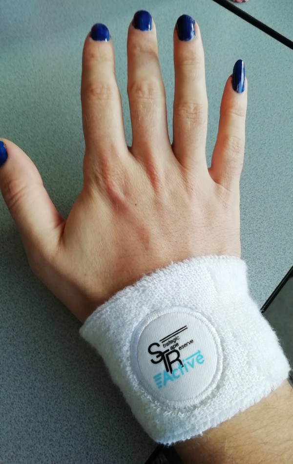

<iframe style="border: 0; width: 600px; height: 600px;" src="https://bandcamp.com/EmbeddedPlayer/album=3456685329/size=large/bgcol=ffffff/linkcol=2ebd35/minimal=true/transparent=true/" seamless=""><a href="http://strategictapereserve.bandcamp.com/album/these-carbon-composite-poles-are-made-for-walkin">These Carbon-Composite Poles Are Made For Walkin&#39; by Various Artists</a></iframe>

* * *

I always go Nordic walking to work, except I never do, because I don't own any Nordic walking poles. 

But now Strategic Tape Reserve has the perfect solution with this collection of carbon-composite music. It's _almost_ like you're wielding your trusty poles when you put this baby on your Nordic walkman.

As you now, Nordic walking is an extreme sport, so you can't just go Nordic walking without your poles. That's irresponsible. Much safer to just go regular walking when you don't have poles. But with this tape, you can just about manage what would previously be unthinkable.

This is because the tracks are all lightweight, but solid, made out of high-grade synthetics, yet affordable! The finest plastics and carbons were sourced from among the world's best manufacturers, such as **qualchan.**, **Emerging Industries of Wuppertal**, and **VLK**.

What makes the whole even better are authentic Swedish tips from a real Fittness Instruktör, who will teach you proper _stavgångsteknik_ (that's 'pole-going-technique', for all you poor non-Nordics). These are so good that you will learn to exercise the right technique even without poles!

Of course, all of this intense sporting will make you sweat, so STS made sure to include a last vital part of your equipment: a sweatband. Look how well it goes with my nails! And indeed, it "can help reduce sweat-related injuries by up to 15%." Win!

Be sure to tell your employer and insurance company about the benefits of Nordic walking for your health and productivity!

> _These Carbon​-​Composite Poles Are Made For Walkin'_ is currently sould out on tape from the label, [but you can still buy the digital version](https://strategictapereserve.bandcamp.com/album/these-carbon-composite-poles-are-made-for-walkin), which is almost as good. Be sure to provide your own sweatband!
