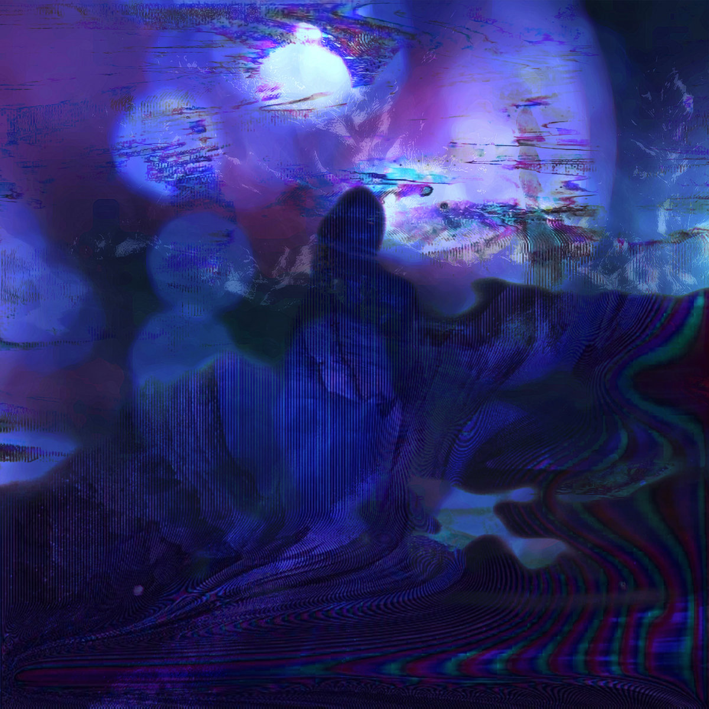

* * *

**_Art Blakey's Jazz Messengers_** _with_ **_Thelonious Monk_** (1958, Atlantic)

A swinging collection of (mostly) Monk compositions, with Blakey and his Messengers making sure the rhythm is tight as can be.

https://open.spotify.com/album/3C2hpKCQ1C8l8F5sLAQHXe?si=PO224-PZQmiVmIvMI0d9Uw

* * *

**astvaldur** (Ástvaldur Axel Þórisson) dropped some amazing dark minimal techno this year on _Correlation Attempts_ (out on Falk Records). Cold atmospheres, varied beat patterns, and sharp edges make this into an album to be reckoned with.

<iframe style="border: 0; width: 600px; height: 600px;" src="https://bandcamp.com/EmbeddedPlayer/album=1277331425/size=large/bgcol=ffffff/linkcol=de270f/minimal=true/transparent=true/" seamless=""><a href="http://falkworld.bandcamp.com/album/correlation-attempts">Correlation Attempts by astvaldur</a></iframe>

* * *

An old Swans tape got buried somewhere in Syria and was dug up by a bunch of local synth aficionados. Or at least, that's what **Big Debbie**'s _ABRACADEBRA_ (2018, Ratskin Records) sounds like at times. Deserty industrial rock for fuzz-headed freaks.

<iframe style="border: 0; width: 600px; height: 600px;" src="https://bandcamp.com/EmbeddedPlayer/album=2596770283/size=large/bgcol=333333/linkcol=0f91ff/minimal=true/transparent=true/" seamless=""><a href="http://ratskinrecords.bandcamp.com/album/ab-ra-ca-deb-ra">&quot;AB RA CA DEB RA&quot; by BIG DEBBIE</a></iframe>

* * *

When mummy wants some bleeps and beats, it's time to grab an album like **Glitch Black**s _World's Ruin_ (2015). High-intensity synthwave for an end of a world.

<iframe style="border: 0; width: 600px; height: 600px;" src="https://bandcamp.com/EmbeddedPlayer/album=140040815/size=large/bgcol=333333/linkcol=e32c14/minimal=true/transparent=true/" seamless=""><a href="http://glitchblack.bandcamp.com/album/worlds-ruin">World&#39;s Ruin by Glitch Black</a></iframe>

* * *

**Ingrid Laubrock**'s works bridge modern classical and jazz, composition and improvisation. _Contemporary Chaos Practices_ is a powerful, demanding collection, at times dark and heavy, but free in spirit. The interaction between orchestra, soloists (guitar, piano, trumpet, sax), and duo of conductors is intricate and inspiring—all up to the challenges posed by these ambitious scores.

_Contemporary Chaos Practices_ is out on Nov 16 on Intakt Records.

<iframe style="border: 0; width: 600px; height: 600px;" src="https://bandcamp.com/EmbeddedPlayer/album=2460793361/size=large/bgcol=333333/linkcol=ffffff/minimal=true/transparent=true/" seamless=""><a href="http://laubrock-intakt.bandcamp.com/album/contemporary-chaos-practices-two-works-for-orchestra-with-soloists">Contemporary Chaos Practices - Two Works For Orchestra With Soloists by Ingrid Laubrock</a></iframe>

* * *

A **John Coltrane** double bill for me this week. _Ascension_ is wild and seminal, the gateway to Coltrane's free jazz period, while _Dakar_ is full of great hard bop tunes from the late 50s.

https://open.spotify.com/album/2TtadFmrnrFZecasfj0p4t?si=ru58\_ZPYSt2nrTsrVOgUow

https://open.spotify.com/album/2iwEvDsbU48EFIuHoM2o2K?si=1kxOsY33RXShPoNW2ylqJA

* * *

**SARRAM** brings us four tracks based on guitar and synth, ranging from heavy post-rocking drones to melodic ambient passages. _Four Movements of a Shade_ is a convincing sophomore effort for Valerio Marras, and will come out Nov 23 on Midira.

https://soundcloud.com/midirarecords/sarram-lll

* * *

Very fine dynamic ambient on **Tangent**'s latest album for n5MD, _Approaching Complexity_. Which is what the beats do as the album progresses: more complex bass rhythms joined by soft waves and twinkling melodies.

<iframe style="border: 0; width: 600px; height: 600px;" src="https://bandcamp.com/EmbeddedPlayer/album=306076496/size=large/bgcol=333333/linkcol=e99708/minimal=true/transparent=true/" seamless=""><a href="http://n5md.bandcamp.com/album/approaching-complexity">Approaching Complexity by Tangent</a></iframe>

* * *

_Descendre_ by **Terje Rypdal** (with Palle Mikkelborg and Jon Christensen – 1980, ECM) is a very focused, trio-based work that casts jazz improv into a spacy rock mould. Quite often, the sound is carried by keyboards and either guitar or trumpet/flugelhorn, which gives the whole a floating ambient quality that’s irresistably calming. Christensen on drums and percussion is understatedly brilliant.

https://open.spotify.com/album/2Ij70NSbKOJtCjGWURQdtr?si=8PCHrtX0QuSdv6xqPqkq5w

* * *

Genre-defying electronics from **valyri** on _let go_ (2018). Deep ethereal melodies, warped vocals and drums. Astral dancing. Available through subscription only, but highly recommended: [https://valyri.com/album/let-go](https://valyri.com/album/let-go). Or perhaps a label should pick this up! (plz!)

* * *

Proper dark synth beats with a noisy edge on **ZAVOLOKA**'s _Promeni_ (2018, kvitnu). Heavy, stomping bass kicks and grainy low-end synths form the base for this otherworldly collection of tracks.

<iframe style="border: 0; width: 600px; height: 600px;" src="https://bandcamp.com/EmbeddedPlayer/album=4161133261/size=large/bgcol=333333/linkcol=e99708/minimal=true/transparent=true/" seamless=""><a href="http://kvitnu.bandcamp.com/album/promeni">Promeni by Zavoloka</a></iframe>

* * *
