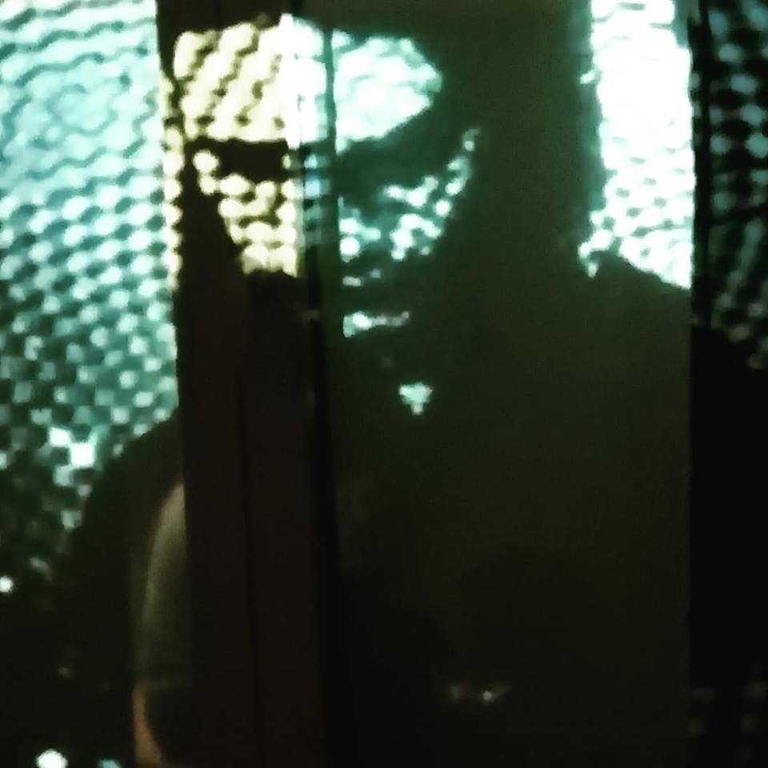
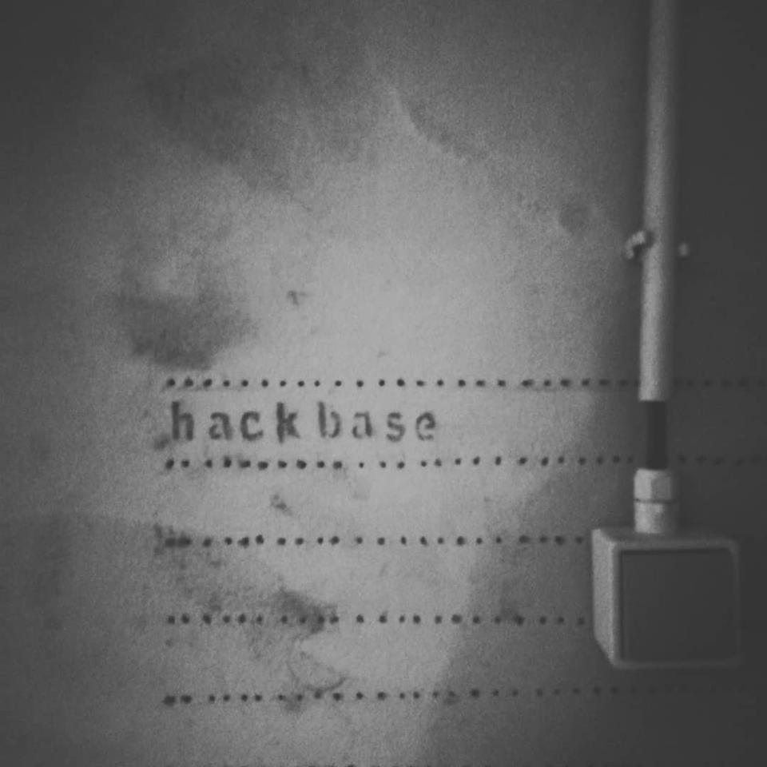
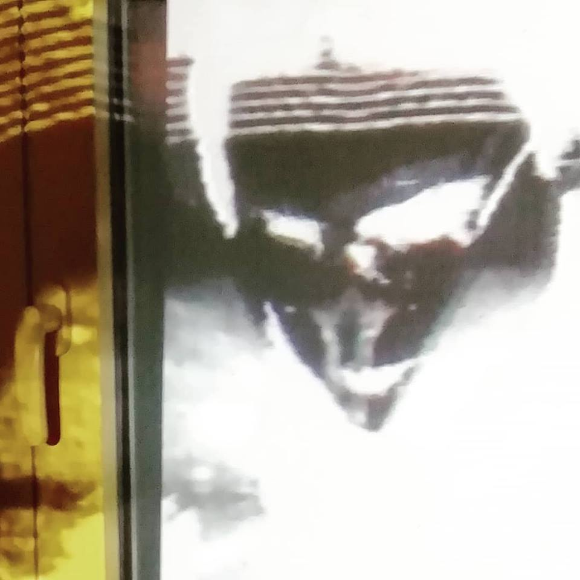

- 
    
- 
    
- 
    

On December 16th a bunch of ladies gathered in an Antwerp basement to make a bunch of noise. It was good.

I was ecstatic when the organiser asked me around a month earlier whether I'd like to be a DJ for a **Deeat Palace** performance—**Vehemen** was added to the bill later. While I've been doing these online mixes for over eight years now, it's been a long time since I deejayed a live set—so long that I'm too embarrassed to admit how long—and it had been something of a low key dream for me to start doing that again. So first of all, thanks immensely to Diny for giving me the opportunity to do just that.

The evening was a resounding success, in my opinion. We gathered in S14, which is an Antwerp townhouse converted into a queer living/art/hack space. We hooked up our wires, pumped sound from the basement to the living room which would become a social / chill area for the guests later that night. And we pumped video, too! (Thanks Caro Orca). Both Deeat Palace and Vehemen delighted with super-intense rhythmic noise sets, of which you can get a chaotic impression in my insta videos ici (caution, this shit is LOUD):

https://www.instagram.com/p/BrdSLA8CyzcK9jdqx5NzKhsIfje-W\_L3P-Wr4o0/

https://www.instagram.com/p/Brda2vQimnvsn-2WZel4Z25xfj8\_X3rimT01WQ0/

You know what was the great thing? This whole evening was produced by women, ~90% of the guests were women, and the vibe was the absolute best. You and I both know that experimental and underground music is, like pretty much all music, a male-dominated field, and this is reflected in many gigs, events, and other scene things. Of course this is not always a huge problem as long as dudes behave themselves, but, well… yeah, we know how _that_ goes.

But that's why this was such a refreshing event to be and play at, and I hope I reflected that in my playlist, which is purposefully focused sharply (_almost_ exclusively) on female artists. This meant a bit more digging through my collection, but I believe the result is worth it. So, enjoy these studio impressions (think of them as platonic ideals or alternate takes) of the set I played at S14:

<iframe width="100%" height="120" src="https://www.mixcloud.com/widget/iframe/?hide_cover=1&amp;feed=%2Feveningoflight%2Flive-at-s14-part-1%2F" frameborder="0"></iframe>

<iframe width="100%" height="120" src="https://www.mixcloud.com/widget/iframe/?hide_cover=1&amp;feed=%2Feveningoflight%2Flive-at-s14-part-2%2F" frameborder="0"></iframe>

<iframe width="100%" height="120" src="https://www.mixcloud.com/widget/iframe/?hide_cover=1&amp;feed=%2Feveningoflight%2Flive-at-s14-part-3%2F" frameborder="0"></iframe>

* * *

Full tracklist:

**Alison Cotton** - A Tragedy in The Tithe Barn  
**poemme** \- with the changing of the leaves  
**The Floating World** - Anemone (2 versions)  
**Maria Monti** - Aria, terra, acqua e fuoco  
**ARIADNE** \- fount of love  
**Áine O'Dwyer** - Hyperbolia / Boatwoman  
**Vouna** \- Last Dream  
**Leah Buckareff** - Ochre  
**Olga Wojciechowska** - Lazy Indifference  
**Yazz Ahmed** - La Saboteuse  
**Isnaj Dui** - That Which Was Lost  
**Jamie Awakshidar** feat. **Evelyn Glyndwr** - Metro + Interstellar  
**Music for Indoor Pools** - I: 3  
**AUN** \- La Luna  
**Elizabeth Joan Kelly** - Sci Fi Drive  
**Barbara Morgenstern** - Hands Dance  
**Sixth Comm** - Birth of the Seven  
**Zavoloka** \- Flame From Within  
**Adult**. - Everything & Nothing  
**Diamanda Galás** - This Is the Law of the Plague  
**Diamanda Galás** - Deliver Me from Mine Enemies

**Wolves in the Throne Room** - A Looming Resonance  
**Aïsha Devi** - 1%  
**Björk** \- Army of Me  
**FOOZOOL** \- AZAT Ազատ  
**ARGIFLEX** \- Crystal Highway (DAWtypeBeat)  
**valyri** \- ntccccccccPN.11lr(diminisssssssswaste)op.29  
**Shanna Sordahl** - The Strength of Blue  
**Natalia Beylis** - Cats Are Sleeping  
**Allseits** \- Hel

**Swans** \- Children of God  
**Hante**. - Empty Space  
**Wizard Apprentice** - Sensuality  
**Semiotics Department of Heteronyms** - She Uncovers Before Me  
**Rojin Sharafi** - Pulp  
**Ingrid Laubrock** - Contemporary Chaos Practices Part 4  
**ARIADNE** \- half-open mouth  
**ProtoU**\- Pel  
**Julia Kent** & **Jean D.L.** - Part Four  
**Nico** \- Valley of the Kings  
**Jessica Sligter** & **Wilbert Bulsink** - C  
**Hawthonn** \- Lady of the Flood  
**ProtoU** \- Skar Mekh  
**Artefactum** \- The Sorceress  
**Elizabeth Veldon** \- on passing a rowan (for nicky who may be a witche's familiar)  
**Hildegard von Bingen** - Columba Aspexit  
**Halgrath** \- Consecration  
**Troum** & **Nadja** \- Dominium Visgurgis Part 2  
**The Body** - The Myth Arc  
**ASVA** with **Val Dorr** - Canteloube  
**Menace Ruine** - Cup of Oblivion
